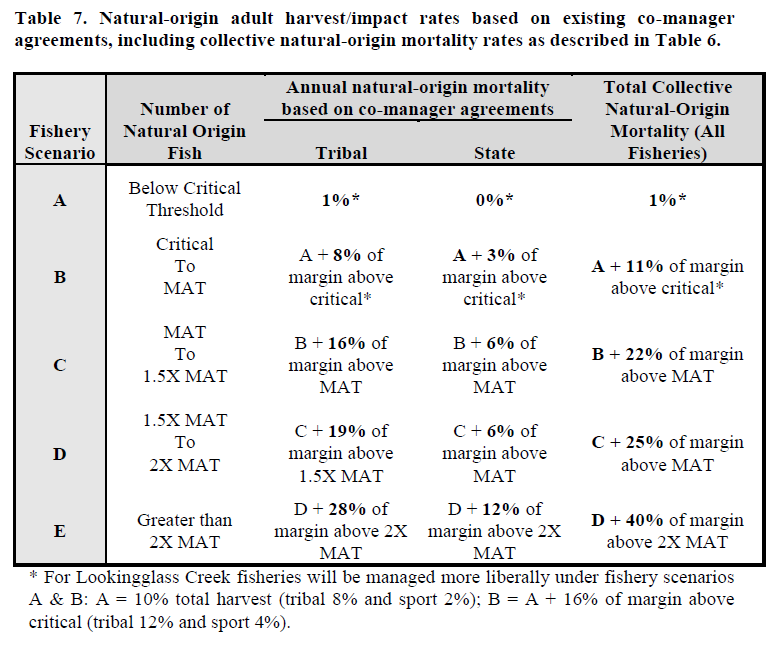
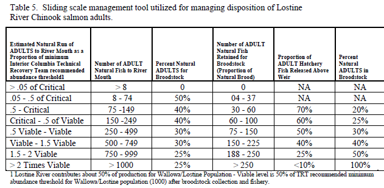
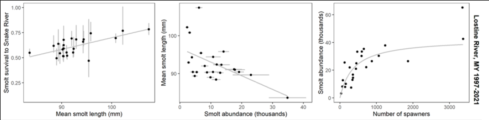

```{r setup, include=FALSE}
suppressPackageStartupMessages({
  library(tidyverse)
  library(readr)
  library(knitr)
  library(kableExtra)
})

source('../R/helpers.R')
source('../R/anchor_funs.R')
source('../R/harvest_funs.R')
source('../R/weir_funs.R')

opts_chunk$set(echo = FALSE, message = FALSE, error = FALSE, warning = FALSE,
               out.width = "100%",
               fig.align="center",
               fig.pos="H")

# default options for tables
options(knitr.kable.NA = '-',
        digits = 2)

# when knitting to Word, use this
# what kind of document is being created?
doc.type <- knitr::opts_knit$get('rmarkdown.pandoc.to')

if(!(is.null(doc.type)) && doc.type == 'docx') {
  options(knitr.table.format = "pandoc")
}

if(!(is.null(doc.type)) && doc.type %in% c("docx", "html")) {
  theme_set(theme_pubr(base_family = "Times New Roman"))
}
```

# Background

The Lostine River spring Chinook (*Oncorhynchus tshawytscha*) hatchery program is an integrated supplementation program intended to rebuild and maintain naturally spawning populations while providing harvest opportunities and meeting Tribal and mitigation obligations. Management of returning adults at the Lostine River weir is central to achieving these objectives because every adult entering the management area must ultimately be allocated among broodstock collection, natural spawning, hatchery removal, and harvest. Decisions made at the weir directly influence hatchery production, natural spawning abundance, harvest opportunity, and the genetic composition of both the hatchery broodstock and naturally spawning population [@npt_hatchery_2011].

Since implementation of the Lostine River Hatchery and Genetic Management Plan (HGMP) in 2011, these decisions have been guided by a stepped "sliding scale" developed cooperatively by the Oregon Department of Fish and Wildlife (ODFW), the Nez Perce Tribe (NPT), and the Confederated Tribes of the Umatilla Indian Reservation (CTUIR). The sliding scale recognizes that management priorities change with natural-origin abundance. At low abundance, demographic risks to population persistence were considered the greatest concern, and management emphasized maximizing natural spawning abundance, even if this required allowing relatively high proportions of hatchery-origin fish to spawn naturally. As abundance increased, demographic risks declined and management progressively shifted toward reducing the genetic influence of hatchery fish by increasing the proportion of natural-origin broodstock and limiting hatchery-origin spawning. Although metrics such as the proportion of natural-origin broodstock (pNOB), proportion of hatchery-origin spawners (pHOS), and proportionate natural influence (PNI) are now commonly used to evaluate hatchery program performance, these quantities were not direct management objectives under the sliding scale. Rather, they emerged as outcomes of the broodstock and weir accounting process.

Harvest management has historically been implemented independently through the Grande Ronde Fishery Management and Evaluation Plan (FMEP). The FMEP uses preseason and inseason forecasts of natural-origin abundance together with abundance thresholds to determine allowable fishery impacts while ensuring sufficient adults remain to satisfy broodstock and conservation objectives. Consequently, harvest management determines the number of adults expected to arrive at the weir, whereas the sliding scale determines how those adults are subsequently partitioned among broodstock, natural spawning, hatchery removal, and passage above the weir.

More than a decade of implementation has produced substantially more information than was available when the original sliding scale was developed. Long-term monitoring of adult returns, juvenile production, broodstock composition, natural spawning, and recruitment now provide opportunities to revisit many of the assumptions that formed the basis of the original framework. In addition, advances in analytical methods make it possible to replace fixed abundance thresholds with biologically informed relationships that respond continuously to changes in abundance while maintaining the existing harvest framework and co-manager decision process.

Recently, ODFW developed a proposed alternative referred to as the **Anchor Method**. Rather than replacing the existing harvest framework or changing the biological objectives of the supplementation program, the Anchor Method proposes a new accounting framework for allocating adults after abundance has been estimated. The proposed method replaces the stepped broodstock accounting of the sliding scale with a continuous relationship between natural-origin abundance and broodstock composition while retaining the existing harvest framework and overall management philosophy.

The purpose of this memorandum is to evaluate the proposed Anchor Method relative to the existing sliding-scale framework. Specifically, this review has four objectives:

1. Summarize the biological rationale and accounting framework of the proposed Anchor Method.
2. Compare historical weir management outcomes under the Anchor Method and the existing sliding scale.
3. Evaluate the sensitivity of the Anchor Method across a range of natural-origin abundance, hatchery-origin abundance, and spawner-goal scenarios.
4. Explore an alternative approach to weir management that explicitly balance broodstock requirements, harvest opportunity, natural spawning, and hatchery influence.

The intent of this review is not to advocate for or against the Anchor Method, but rather to evaluate its assumptions, identify its strengths and limitations, and determine whether it better supports the biological and management objectives of the Lostine River spring Chinook supplementation program.

# Current Weir Management Framework

Management of returning adults at the Lostine River weir occurs through two complementary but independent decision frameworks: (1) the harvest framework described in the Grande Ronde Fishery Management and Evaluation Plan (FMEP), and (2) the weir management framework described in the Hatchery and Genetic Management Plan (HGMP). Although these frameworks operate sequentially, they serve different purposes and address different management objectives.

The harvest framework determines how many natural-origin (NOR) and hatchery-origin (HOR) fish are available for harvest based on preseaon and inseason forecasts. The harvested fish are then removed to calculate the expected number to arrive at the weir after fisheries have occurred. The sliding scale is then applied to those post-harvest adults to determine broodstock collection, natural spawning, hatchery fish passage above the weir, and hatchery removals. Consequently, harvest management influences the number of adults available for weir management, whereas the sliding scale determines how those adults are ultimately allocated.

This distinction is important because the proposed Anchor Method replaces only the weir accounting framework. The existing harvest framework, treaty allocations, and biological objectives remain unchanged. Figure \@ref(fig:current-framework) illustrates the current process and independent steps taken to allocate fish once they arrive to the weir. The sliding scale step is the only piece that is replaced with the anchor method.


```{r current-framework, fig.cap="Conceptual overview of the existing Lostine River management framework."}

library(ggplot2)

nodes <- tibble::tribble(
  ~x, ~y, ~label, ~status,
   1, 7, "Adult Return Forecast", '0',
   1, 6, "Harvest Impact Calculator", '0',
   1, 5, "Adults Arriving at Weir", '0',
   1, 4, "Sliding Scale", '1',
   1, 3, "Broodstock", '0',
   1, 2, "Natural Spawning", '0',
   1, 1, "HOR Passage / Removal", '0',
   1, 0, "pNOB, pHOS, PNI", '0'
)

ggplot(nodes, aes(x,y)) +

geom_label(aes(label=label, fill = status),
           size=5,
           label.size=.5) +
  
geom_segment(aes(x=1,xend=1,
                 y=6.75,yend=6.25),
             arrow=arrow(length=unit(.25,"cm")))+

geom_segment(aes(x=1,xend=1,
                 y=5.75,yend=5.25),
             arrow=arrow(length=unit(.25,"cm")))+

geom_segment(aes(x=1,xend=1,
                 y=4.75,yend=4.25),
             arrow=arrow(length=unit(.25,"cm")))+

geom_segment(aes(x=1,xend=1,
                 y=3.75,yend=3.25),
             arrow=arrow(length=unit(.25,"cm")))+

geom_segment(aes(x=1,xend=1,
                 y=2.75,yend=2.25),
             arrow=arrow(length=unit(.25,"cm")))+

geom_segment(aes(x=1,xend=1,
                 y=1.75,yend=1.25),
             arrow=arrow(length=unit(.25,"cm")))+

geom_segment(aes(x=1,xend=1,
                 y=.75,yend=.25),
             arrow=arrow(length=unit(.25,"cm")))+

scale_fill_manual(values = c('white', 'cadetblue')) +
theme_void() +
  theme(legend.position = 'none') +
coord_cartesian(xlim=c(.5,1.5),
                ylim=c(-.5,7.5))

```

## Harvest Impact Calculator

Harvest is managed independently through the Grande Ronde Fishery Management and Evaluation Plan (FMEP). Preseason forecasts of natural-origin abundance are combined with the Critical Threshold (CT) and Minimum Abundance Threshold (MAT) to determine allowable fishery impacts. Allowable harvest increases as natural-origin abundance increases while maintaining sufficient escapement to satisfy conservation objectives.

Within the FMEP, preliminary harvest levels are first estimated using abundance-based harvest relationships. Those harvest levels are subsequently evaluated relative to broodstock requirements. If projected harvest would prevent broodstock goals from being achieved, harvest impacts are reduced until sufficient adults remain to satisfy broodstock needs. Consequently, broodstock protection places an upper limit on allowable harvest rather than harvest being an independent management objective.

Once fisheries have concluded, the remaining adults are managed at the weir according to the sliding scale.

```{r fmep-harvest-impacts, fig.cap = 'Copied from the 2012 Fisheries Management and Evaluation Plan for Spring Chinook in the Grande Ronde Subbasin.'}

```

## Existing Sliding Scale

The sliding scale was developed during implementation of the Lostine River integrated supplementation program to balance multiple management objectives that change as population abundance varies. Rather than applying a single management strategy across all return sizes, the sliding scale acknowledges that demographic and genetic risks differ between years of low and high abundance, and must be treated accordingly.

At low natural-origin abundance, demographic risk to population persistence was considered the greatest concern. Management therefore emphasized maximizing the total number of adults spawning naturally, even if this required allowing relatively large numbers of hatchery-origin fish upstream. Broodstock collection also relied more heavily on hatchery-origin fish because the relatively few natural-origin adults available were prioritized for natural spawning.

As natural-origin abundance increased, demographic risks diminished and management progressively shifted toward reducing genetic risks associated with hatchery supplementation. Greater numbers of natural-origin adults were incorporated into the broodstock, hatchery-origin fish passage above the weir was reduced, and hatchery-origin removals increased. This transition was implemented through a stepped relationship between natural-origin abundance and desired broodstock composition.

Although pNOB, pHOS, and PNI are now widely used to evaluate integrated and segregated hatchery programs, they were not explicitly managed under the sliding-scale approach. Rather, they served as performance metrics to assess broodstock collection and the composition of natural spawning populations, providing a method for evaluating the potential of hatchery introgression.

> Note: The proportion of natural influence (PNI) does not directly measure the effects of hatchery-origin fish on natural populations. Rather, it is a demographic index that reflects the relative influence of natural- and hatchery-origin fish on the spawning population by weighting the contributions of natural-origin broodstock and hatchery-origin spawners. As such, PNI serves as a proxy for the potential balance between natural and hatchery selection rather than a measure of biological impact. Direct evaluations of hatchery effects on population productivity and fitness are more appropriately obtained through parentage analyses, relative reproductive success (RRS) studies, and other demographic investigations that quantify the reproductive performance and long-term contribution of hatchery- and natural-origin fish.

```{r lostine-sliding-scale, fig.cap = 'Copied from the 2011 Hatchery and Genetic Management Plan for Grande Ronde Spring Chinook Salmon Supplementation Program.'}

```

<!-- ## Existing Decision Process -->

<!-- The complete management framework follows a sequential series of decisions: -->

<!-- 1. Estimate preseason natural-origin and hatchery-origin returns. -->
<!-- 2. Determine allowable fishery impacts using the FMEP harvest framework. -->
<!-- 3. Estimate post-harvest adults arriving at the weir. -->
<!-- 4. Apply the sliding scale to determine broodstock composition. -->
<!-- 5. Allocate remaining adults among natural spawning, hatchery removals, and passage above the weir. -->
<!-- 6. Calculate resulting performance metrics, including pNOB, pHOS, and PNI. -->

<!-- An important consequence of this decision process is that pNOB, pHOS, PNI, harvest opportunity, and hatchery removals are not independent management objectives. Rather, they emerge from the interaction among harvest management, broodstock collection, and natural spawning objectives. -->

## Limitations of the Existing Framework

The sliding scale has successfully guided Lostine River weir management for more than a decade and has provided a transparent and repeatable process for balancing conservation and production objectives. Nevertheless, several characteristics of the framework create operational complexities, limit managers' ability to achieve program objectives, and constrain the incorporation of new biological information into management decisions.

First, operational complexities arise when natural- and hatchery-origin abundance forecasts are updated in season. As forecasts change, they may cross predefined abundance thresholds, causing abrupt shifts in broodstock composition and hatchery fish disposition. Consequently, relatively small differences in estimated abundance can result in substantially different management actions despite little biological difference between return sizes.

Second, integrated supplementation programs are intended to increase natural production and provide harvest opportunities by allowing hatchery-origin fish to contribute to natural spawning while maintaining acceptable levels of genetic risk. Under the current sliding scale, high natural-origin returns can trigger increased removal of hatchery-origin fish at the weir, thereby reducing the number of hatchery fish available to spawn naturally. This can limit the demographic contribution of the hatchery program and reduce future production and harvest opportunities, even when natural-origin abundance is sufficient to meet broodstock and spawning objectives.

Third, the abundance thresholds and associated assumptions regarding genetic risk were developed more than 15 years ago using the best information available at that time. Since implementation of the HGMP, extensive monitoring has substantially improved our understanding of supplementation outcomes in the Lostine River and other spring/summer Chinook Salmon populations. These data include long-term records of adult abundance, juvenile production, broodstock performance, natural spawning, spawner-recruit relationships, and genetic parentage analyses that directly evaluate the reproductive success of hatchery- and natural-origin fish. The current sliding-scale framework has limited flexibility to incorporate this growing body of scientific information without revising the threshold structure itself.

Finally, because the sliding scale is based on fixed abundance categories, adapting the framework requires modifying decision thresholds rather than simply updating the biological information that informs management decisions. This makes the framework less responsive to new scientific understanding and more difficult to refine as additional monitoring data become available.

These limitations motivated development of the proposed Anchor Method, which retains the existing harvest framework and management objectives while replacing the stepped broodstock accounting with a continuous, biologically informed relationship between natural-origin abundance and broodstock composition.

# Objective 1: Anchor Method Summary {#sec:obj1}

The proposed Anchor Method was developed to retain the existing biological objectives, harvest framework, and co-manager decision process while replacing the stepped broodstock accounting of the sliding scale with a continuous, biologically informed relationship. Rather than applying the same management response across broad abundance categories, the Anchor Method adjusts the desired natural-origin contribution to broodstock proportionally based on the estimated natural-origin return and identified spawner goal.

The approach is intended to reduce abrupt changes in management actions near sliding-scale thresholds, make greater use of long-term monitoring information, and provide an accounting framework that can be updated as biological understanding improves. The structure of the method remains fixed, but key biological and operational inputs—including the spawner goal, broodstock need, fishery impacts, trap proportions, weir efficiency, and pre-spawn survival—can be revised through the co-manager process.

## Conceptual Overview

The Anchor Method does not propose a new harvest policy or a new set of biological objectives. Rather, it proposes a different accounting framework for allocating adults after natural-origin (NOR) and hatchery-origin (HOR) abundance have been estimated. The existing FMEP harvest relationships, treaty and non-treaty allocation framework, annual broodstock need, and overall objectives of the integrated hatchery program remain unchanged.

The largest change in the new approach is a replacement of the stepped broodstock targets of the sliding scale with a continuous relationship between NOR abundance and the desired proportion of natural-origin broodstock. This relationship is established using a calculated benchmark referred to as the **Anchor**.

The Anchor is separate from the annual mixed-origin accounting. It is not an escapement target, a run-size forecast, or a desired number of fish to manage toward in a particular year. Instead, it is a reference abundance used to determine the desired natural-origin contribution to broodstock under a given management scenario.

## The Anchor

The Anchor represents the minimum NOR adult abundance required to satisfy two conditions under the assumption that the entire broodstock is composed of natural-origin fish:

1. enough NOR adults remain after expected fishery impacts to fill the full broodstock need; and
2. enough NOR adults survive to spawning to achieve the adult spawner goal.

The Anchor is determined by evaluating a sequence of candidate NOR abundances. For each candidate abundance, the accounting applies projected NOR fishery impacts, partitions the remaining adults at the weir, allocates broodstock entirely from captured NOR fish, applies pre-spawn survival, and evaluates whether both the broodstock requirement and spawner goal are met. The smallest candidate abundance satisfying both conditions and becomes the Anchor.

The Anchor therefore depends on several assumptions and inputs, including:

- annual broodstock need;
- adult spawner goal;
- FMEP fishery impact relationships;
- the Wallowa/Lostine population scaling factor;
- the proportion of NOR adults captured at the weir;
- weir efficiency; and
- pre-spawn survival above and below the weir.

Once the Anchor is calculated, the desired annual proportion of natural-origin broodstock is determined from the ratio of the NOR forecasted abundance to the Anchor:

\[
\text{desired pNOB} =
\min\left(1,\frac{\text{NOR abundance}}{\text{Anchor}}\right).
\]

When NOR abundance equals or exceeds the Anchor, the desired pNOB is 1.0. When NOR abundance is below the Anchor, the desired pNOB declines proportionally. For example, an estimated NOR abundance equal to one-half of the Anchor produces a desired pNOB of 0.5.

> Note: Calculating the desired pNOB from the anchor is fine, my concerns come from the exclusion of HOR fish spawning naturally once the anchor/spawner goal is met. The spawner goal limits natural production by only allowing NOR fish to spawn above this threshold.

## Management Priorities

The Anchor Method follows a sequential accounting process based on our review of the current functions and supporting documentation. The practical priorities of the method are:

1. Establish an agreed upon spawner goal from available information.
1. Calculate a desired natural-origin broodstock contribution (pNOB) from the Anchor relationship.
2. Protect the availability of enough NOR and HOR adults to satisfy the broodstock requirement.
3. Apply fisheries to the extent allowed using the existing harvest impact relationships and origin specific broodstock requirements.
4. Allocate captured adults to broodstock.
5. Estimate the number of NOR and HOR adults expected to survive to spawn naturally.
6. Pass all remaining NOR fish and the balance of captured HOR adults upstream to achieve the adult spawner goal.
7. Remove remaining excess of captured HOR adults after broodstock allocation and necessary upstream passage.

This sequence contains an important distinction. Fisheries are reduced when projected impacts or harvest would leave too few adults available to meet the broodstock target. However, the current accounting does **not** further reduce fisheries specifically to reserve fish for the spawner goal. Instead, after fisheries and broodstock collection have occurred, captured HOR fish are passed upstream when additional spawners are needed to meet the desired goal.

Consequently, broodstock receives explicit protection from fisheries, whereas the spawner goal is addressed later through the disposition of available HOR adults. If insufficient NOR and HOR adults remain after fisheries and broodstock collection, the calculated spawner goal may not be achieved. Conversely, once the spawner goal is met, additional HOR fish will be removed and not allowed to spawned.

>*Note: Removing HOR fish once the spawner goal is met prohibits managers from taking advantage of "good" return years to boost natural production past low abundance goals relative to historical numbers, and deprives the environment of a large influx of marine derived nutrients.*

## Accounting Sequence

### Fishery calculations and broodstock protection

For a given management scenario, preliminary NOR fishery impacts are first calculated using the existing sport and treaty harvest relationships. Preliminary HOR harvest is then estimated using the existing fishery allocation and catch-balancing assumptions.

The method evaluates whether the projected fisheries would leave enough adults to meet broodstock needs. The desired number of NOR broodstock is calculated from the Anchor-based pNOB relationship. The number of NOR adults that must remain after fisheries is then estimated from the expected proportion captured at the weir.

If projected NOR impacts would leave too few NOR adults to meet the desired NOR broodstock contribution, sport and treaty NOR impacts are reduced proportionally. A similar cap is applied to HOR harvest when HOR adults are needed to fill the portion of broodstock demand not expected to be met by NOR fish.

These caps protect broodstock availability while retaining the relative allocation of impacts or harvest between fisheries. They do not independently reserve fish for natural spawning.

>*Note: Harvest impact calculators automatically prioritize broodstock and natural spawning by only allowing a proportion of fish for harvest. However, a tipping point may exist where too few natural spawners creates a negative feedback loop and future returns continue to decline.*  

### Post-fishery weir partitioning

Following fisheries, the remaining NOR and HOR adults are partitioned into three groups:

1. adults captured at the weir;
2. adults that pass above the weir without being captured; and
3. adults remaining below the weir.

The number captured is determined using origin-specific trap proportions. Weir efficiency is then used to estimate the number of adults that passed above the structure without being captured. Remaining adults are assigned below the weir.

This accounting distinguishes the proportion of the total return captured at the weir from weir efficiency. The trap proportion describes how many adults from the management-area return were captured, including fish that may never have reached the weir. Weir efficiency describes the probability of capture among fish that encountered or passed the weir and is used to estimate uncaptured passage above it.

### Broodstock allocation

Captured NOR adults are allocated to broodstock first, up to the desired NOR contribution determined by the Anchor relationship. Captured HOR adults are then used to fill any remaining broodstock need.

The resulting realized pNOB may differ from the desired pNOB when too few NOR adults are captured at the weir. Final pNOB is therefore calculated from the realized broodstock allocation rather than directly from the Anchor slope:

\[
\text{pNOB} =
\frac{\text{NOR broodstock}}{\text{total broodstock need}}.
\]

### Natural spawner accounting

After broodstock allocation, remaining adults are evaluated as potential natural spawners. NOR adults captured but not used for broodstock are treated as available for passage above the weir. NOR and HOR adults that passed the weir without capture, as well as adults remaining below the weir, also contribute to the estimated spawning population.

Pre-spawn survival is applied separately to fish above and below the weir. Adults are not counted as spawners merely because they were present in the river or passed above the weir; they contribute to the final spawner estimate only after the applicable survival rate has been applied.

### HOR passage and removal

The accounting next compares the estimated number of spawners with the adult spawner goal. If the estimated spawning population is below the goal, captured HOR adults remaining after broodstock collection are passed above the weir, up to the number expected to close the deficit after accounting for pre-spawn survival.

Captured HOR adults are therefore passed upstream only when needed to achieve the spawner goal. Once the goal has been achieved, or when all available HOR adults have been used, any remaining captured HOR adults are removed from the system.

This decision rule produces predictable outcomes across return conditions. At low NOR abundance, more HOR adults may be required for broodstock and natural spawning, generally resulting in higher pHOS. At high NOR abundance, fewer HOR adults are needed to achieve either objective, generally resulting in greater HOR removal and pHOS approaching zero.

## Comparison with the Sliding Scale

The Anchor Method retains much of the existing management framework but changes how desired broodstock composition is determined. The principal differences are summarized in Table \@ref(tab:framework-comparison).

```{r framework-comparison, tab.cap="Conceptual comparison of the existing sliding-scale framework and the proposed Anchor Method."}
framework_comparison <- tibble::tribble(
  ~Characteristic, ~`Existing Sliding Scale`, ~`Proposed Anchor Method`,
  "Broodstock decision structure",
  "Discrete abundance categories",
  "Continuous relationship with NOR abundance",

  "Basis for desired pNOB",
  "Predetermined values within each abundance category",
  "NOR abundance relative to the calculated Anchor",

  "Transition between management responses",
  "Abrupt change when a threshold is crossed",
  "Gradual change as NOR abundance changes",

  "Harvest framework",
  "Existing FMEP relationships",
  "Existing FMEP relationships retained",

  "Harvest constraint",
  "Broodstock and program requirements",
  "Explicit origin-specific broodstock-protection caps",

  "Spawner management",
  "HOR passage determined from sliding-scale prescriptions",
  "HOR passed when needed to support the spawner goal",

  "pHOS",
  "Outcome of weir management",
  "Outcome of spawner accounting and HOR passage",

  "PNI",
  "Outcome of pNOB and pHOS",
  "Outcome of pNOB and pHOS",

  "Ability to incorporate new information",
  "Requires modification of categories or prescribed values",
  "Biological and operational inputs can be updated without changing the basic structure"
)

knitr::kable(
  framework_comparison,
  booktabs = TRUE,
  longtable = TRUE
) %>%
  kableExtra::column_spec(1, width = "2.0in") %>%
  kableExtra::column_spec(2, width = "2.0in") %>%
  kableExtra::column_spec(3, width = "2.0in") %>%
  kableExtra::kable_styling(
    latex_options = c("repeat_header"),
    full_width = FALSE
  )
```

## Management Defined Spawner Goals

The predefined spawner goal drives the number of NOR fish that will be retained for broodstock and the point HOR fish will be removed from natural spawning. The proportion of NOR broodstock is calculated as the forecasted NOR return divided by the anchor, with the anchor being derived from the spawner goal. Figure \@ref(fig:calc-anchor-range) illustrates the linear dependency between the two values. Thus, using the anchor method managers can easily alter the number of NOR fish being retained for broodstock and the number of HOR fish removed by setting lower or higher spawner goals. Which, will also indirectly influence harvest impacts.

Given the importance of the set spawner goal in the anchor method calculations, managers will need to establish this threshold carefully. Figures \@ref(fig:odfw-prod-curves) and \@ref(fig:stock-recruit) illustrate the potential differences that may occur when establishing the spawner goal. ODFW initially proposed a spawner goal of 800 based on the Beverton-Holt stock-recruit relationship shown in panel three of Figure \@ref(fig:odfw-prod-curves). While a slightly different Lostine River dataset (provided by B. Simmons) and a Ricker stock-recruit model might suggest a much higher spawner goal (Figure \@ref(fig:stock-recruit)). These two approaches could lead to a >50% difference in pNOB and the allowable number of HOR fish released upstream.

```{r load-data}
input_file <- "input_chs.csv"
file_path <- file.path('../data',input_file)

trap <- 'LST'

dat <- read_csv(file_path, show_col_types = FALSE) %>%
  filter(.data$Stock == trap) %>%
  arrange(desc(.data$Year))

# Build trap ratio columns safely. Division by zero becomes NA.
dat <- dat %>%
  mutate(
    trap_ratio_no = if_else(Post.NO == 0, NA_real_, Trap.NO / Post.NO), # trap_ratio is the number trapped out of total return?
    trap_ratio_ho = if_else(Post.HO == 0, NA_real_, Trap.HO / Post.HO)
  )

m_trap_no <- first5_non_na(dat$trap_ratio_no, dat$Year)
m_trap_ho <- first5_non_na(dat$trap_ratio_ho, dat$Year)
m_weir    <- first5_non_na(dat$Weir.Eff,     dat$Year)
m_abv     <- first5_non_na(dat$PSS.ABV,      dat$Year) #what is PSS?
m_blw     <- first5_non_na(dat$PSS.BLW,      dat$Year)


median_params <- list(
  trap_prop_no        = median(m_trap_no$Value), # median proportion of NO captured at the weir; is this equal to weir efficiency?
  trap_prop_ho        = median(m_trap_ho$Value),
  weir_efficiency     = median(m_weir$Value),
  survival_above_weir = median(m_abv$Value),
  survival_below_weir = median(m_blw$Value),
  years_trap_no       = years_used_str(m_trap_no),
  years_trap_ho       = years_used_str(m_trap_ho),
  years_weir          = years_used_str(m_weir),
  years_abv           = years_used_str(m_abv),
  years_blw           = years_used_str(m_blw)
)

```


```{r set-initial-params}
scenario_inputs <- list(
  no_manarea_est = 382,  # current/scenario natural-origin abundance estimate
  ho_manarea_est = 536,   # current/scenario hatchery-origin abundance estimate
  brood_need     = 160,   # broodstock need
  spawner_goal   = 800,   # adult spawner goal
  wl_scaling     = 1.4,    # Wild-Lostine scaling factor
  utilization_no  = 1.0,   # proportion of allowed NO impacts actually taken (1.0 = full utilization)
  utilization_ho  = 1.0    # proportion of allowed HO harvest actually taken (1.0 = full utilization)
)

# Default accounting parameters are the median-derived values.
# These are used for normal planning/review scenarios when current-year actuals
# are unavailable or when use_csv_scenario_values is FALSE.
accounting_params <- list(
  trap_prop_no        = median_params$trap_prop_no,
  trap_prop_ho        = median_params$trap_prop_ho,
  weir_efficiency     = median_params$weir_efficiency,
  survival_above_weir = median_params$survival_above_weir,
  survival_below_weir = median_params$survival_below_weir,
  source_trap_no      = paste0("Median years: ", median_params$years_trap_no),
  source_trap_ho      = paste0("Median years: ", median_params$years_trap_ho),
  source_weir         = paste0("Median years: ", median_params$years_weir),
  source_abv          = paste0("Median years: ", median_params$years_abv),
  source_blw          = paste0("Median years: ", median_params$years_blw)
)

# The Anchor method uses these same policy/scenario assumptions, but only NO fish.
anchor_inputs <- list(
  brood_need   = scenario_inputs$brood_need,
  spawner_goal = scenario_inputs$spawner_goal,
  wl_scaling   = scenario_inputs$wl_scaling
)
```


```{r calc-anchor-range, fig.cap = 'A linear relationship exists between the calculated anchor and the management set spawner goal.'}
# RK added this function to better understand the sensitivity of the spawner goal

test_spawner_goal <- seq(100, 2000, by = 50)

test_anchor_results <- tibble(
  spawner_goal = test_spawner_goal
) %>%
  mutate(
    anchor_result = map(
      spawner_goal,
      \(goal) {
        
        si <- create_scenario_inputs(
          no_manarea_est = scenario_inputs$no_manarea_est,
          ho_manarea_est = scenario_inputs$ho_manarea_est,
          brood_need = scenario_inputs$brood_need,
          spawner_goal = goal,
          wl_scaling = scenario_inputs$wl_scaling,
          utilization_no = scenario_inputs$utilization_no,
          utilization_ho = scenario_inputs$utilization_ho
        )
        
        calculate_anchor_result(
          scenario_inputs = si,
          anchor_inputs = anchor_inputs,
          accounting_params = accounting_params,
          start_est = 0
        )
      }
    ),
    
    anchor = map_dbl(
      anchor_result,
      "anchor_required_no"
    )
  )

# Fit linear model
fit <- lm(anchor ~ spawner_goal, data = test_anchor_results)

coefs <- coef(fit)
r2 <- summary(fit)$r.squared

eqn <- sprintf(
  "Anchor = %.2f + %.3f × Spawner Goal\nR² = %.3f",
  coefs[1], coefs[2], r2
)

ggplot(test_anchor_results,
       aes(x = spawner_goal, y = anchor)) +
  geom_line(linewidth = 1.2) +
  geom_point(size = 2) +
  geom_smooth(method = "lm",
              se = FALSE,
              linetype = 2,
              colour = "red") +
  annotate(
    "label",
    x = min(test_anchor_results$spawner_goal),
    y = max(test_anchor_results$anchor),
    hjust = 0,
    vjust = 1,
    label = eqn,
    size = 5
  ) +
  labs(
    x = "Spawner Goal",
    y = "Minimum Feasible NO Anchor",
    title = "Sensitivity of Anchor to Spawner Goal"
  ) +
  theme_bw()
```


```{r odfw-prod-curves, fig.cap = 'Oregon Department of Fish and Wildlife estimated productivity curves used to set a spawner goal of 800.'}

```


```{r stock-recruit, fig.cap = 'Beverton-Holt and Ricker stock-recruit curves fit to smolt and spawner abundance in the Lostine River. Data provided by Brian Simmons and it includes brood years 1995-2018.'}
include_graphics('../../Chinook-Life-Cycle/figures/plot-smolt-1.png')
```

## Summary

The Anchor Method replaces the discrete broodstock prescriptions of the sliding scale with a continuous relationship between NOR abundance and desired pNOB. Its accounting sequence explicitly protects broodstock availability, applies the existing fishery framework, estimates spawners after pre-spawn survival, passes captured HOR adults when needed to support the spawner goal, and removes remaining captured HOR adults.

The approach provides a transparent connection between assumed biological conditions and resulting management actions. However, the method does not explicitly optimize harvest, constrain pHOS or PNI to management thresholds, or guarantee achievement of the spawner goal under all return conditions. Those quantities remain outcomes of the sequential accounting process.

Although the conceptual differences between the sliding scale and Anchor Method are clear their practical importance depends on whether they produce meaningfully different management outcomes under observed return conditions. Objective 2 therefore evaluates how application of the Anchor Method would have changed broodstock composition, harvest, natural spawning, and HOR disposition during recent management years.

# Objective 2: Anchor Method Comparison to Sliding Scale (Lostine River)  {#sec:obj2}

To evaluate the proposed Anchor Method, we compared the predicted total number of natural spawning adults under the Anchor Method with the realized total number of spawners estimated in the Lostine River under the existing sliding-scale framework. For all simulations, the Anchor Method was parameterized using the ODFW proposed adult spawner goal of 800 fish, a Wallowa–Lostine scaling factor of 1.4, and a broodstock requirement of 160 fish. In addition to the predicted number of spawners, we estimated the number of hatchery-origin fish that would have been removed at the weir under the Anchor Method. Comparisons of other performance metrics, such as hatchery-origin removals, broodstock and spawner composition, pHOS, pNOB, and PNI, were not possible because corresponding realized estimates were not consistently available.

Figure \@ref(fig:annual-comparison) compares the predicted total number of spawners under the Anchor Method with the realized number of spawners observed under the sliding-scale framework. In several years, the observed number of spawners exceeded the number predicted by the Anchor Method. These differences were primarily associated with years in which the Lostine River weir experienced operational challenges or reduced trapping efficiency, allowing additional fish to pass upstream regardless of the management framework. In years when the weir operated as intended, the Anchor Method generally resulted in slightly more total spawners than were observed under the sliding-scale approach. However, these differences were typically small and are unlikely to produce biologically meaningful changes in natural production or substantially alter the potential genetic effects associated with hatchery-origin fish spawning naturally.

The stacked bars in Figure \@ref(fig:annual-comparison) partition the Anchor Method outcomes into the predicted number of natural spawners and the number of hatchery-origin fish removed at the weir. Together, these values represent the total number of fish available after fisheries and illustrate how fish are allocated between natural spawning and removal once broodstock and adult spawner objectives have been achieved. In 2008, 2009, 2012, 2015, 2016, 2018, and 2022, the predicted number of natural spawners under the Anchor Method reached the 800-fish spawner goal. Although additional hatchery-origin fish were available in those years, they would have been removed because the management objectives had already been satisfied and additional spawners were not required.

```{r calc-annual-outcomes}
annual_summary <- dat %>%
  transmute(
    Year,
    no_manarea_est = as.numeric(Post.NO),
    ho_manarea_est = as.numeric(Post.HO)
  ) %>%
  mutate(
    result = map2(
      no_manarea_est,
      ho_manarea_est,
      \(no, ho) {
        evaluate_accounting_scenario(
          no_manarea_est = no,
          ho_manarea_est = ho,
          accounting_params = accounting_params,
          anchor_inputs = anchor_inputs,
          brood_need = 160,
          spawner_goal = 800,
          wl_scaling = 1.4
        )
      }
    )
  ) %>%
  unnest(result)
```

```{r annual-comparison, fig.cap = 'Predicted anchor method total spawners and hatchery removals versus the actual number of total spawners.'}
annual_comparison <- dat %>%
  transmute(
    Year,
    actual_spawners = as.numeric(Tot.Spwn)
  ) %>%
  left_join(
    annual_summary %>%
      transmute(
        Year,
        anchor_spawners = system_spawners,
        anchor_HO_removed = HO_removed
      ),
    by = "Year"
  )

anchor_partition <- annual_comparison %>%
  select(
    Year,
    `Anchor spawners` = anchor_spawners,
    `Hatchery fish removed` = anchor_HO_removed
  ) %>%
  pivot_longer(
    cols = -Year,
    names_to = "outcome",
    values_to = "fish"
  ) %>%
  mutate(
    outcome = factor(
      outcome,
      levels = c(
        "Anchor spawners",
        "Hatchery fish removed"
      )
    )
  )

ggplot() +
  geom_col(
    data = anchor_partition,
    aes(
      x = factor(Year),
      y = fish,
      fill = outcome
    ),
    width = 0.75,
    position = position_stack(reverse = TRUE)
  ) +
  geom_line(
    data = annual_comparison,
    aes(
      x = factor(Year),
      y = actual_spawners,
      group = 1
    ),
    linewidth = 0.8
  ) +
  geom_point(
    data = annual_comparison,
    aes(
      x = factor(Year),
      y = actual_spawners,
      shape = "Actual spawners"
    ),
    size = 2.5
  ) +
  geom_hline(
    yintercept = 800,
    linetype = 2
  ) +
  scale_fill_viridis_d(begin = .2, end = .8) +
  labs(
    x = NULL,
    y = "Number of fish",
    fill = NULL,
    shape = NULL,
    #title = "Actual and Modeled Lostine River Spawner Outcomes",
    subtitle = paste(
      "Columns show modeled Anchor Method spawners and hatchery-origin removals;",
      "points show actual spawners under the sliding scale"
    )
  ) +
  #guides(fill = guide_legend(reverse = TRUE)) +
  theme_bw() +
  theme(
    axis.text.x = element_text(
      angle = 45,
      hjust = 1
    ),
    legend.position = "bottom"
  )
```


```{r set-params, eval = FALSE}
# create a function to loop through this process

use_csv_scenario_values <- FALSE
csv_scenario_year <- 2023

yrs <- unique(dat$Year)

scenario_inputs <- list(
  #no_manarea_est = 382,  # current/scenario natural-origin abundance estimate
  #ho_manarea_est = 536,   # current/scenario hatchery-origin abundance estimate
  brood_need     = 160,   # broodstock need
  spawner_goal   = 800,   # adult spawner goal
  wl_scaling     = 1.4,    # Wild-Lostine scaling factor
  utilization_no  = 1.0,   # proportion of allowed NO impacts actually taken (1.0 = full utilization)
  utilization_ho  = 1.0    # proportion of allowed HO harvest actually taken (1.0 = full utilization)
)


if (use_csv_scenario_values) {
  row_scenario <- dat %>% filter(.data$Year == csv_scenario_year) %>% slice(1)

  if (nrow(row_scenario) == 0) {
    stop("No LST row found for csv_scenario_year.", call. = FALSE)
  }

  # Scenario values from the selected year where available.
  scenario_inputs$no_manarea_est <- pick_est(row_scenario$Post.NO, row_scenario$In.NO, row_scenario$Pre.NO)
  scenario_inputs$ho_manarea_est <- pick_est(row_scenario$Post.HO, row_scenario$In.HO, row_scenario$Pre.HO)
  scenario_inputs$brood_need     <- row_scenario$BS.Need

  # spawner_goal and wl_scaling remain manual unless those values are added to the CSV.

  actual_year_label <- paste0("Actual year: ", csv_scenario_year)

  trap_no_choice <- pick_actual_or_median(
    actual_value = row_scenario$trap_ratio_no,
    median_value = median_params$trap_prop_no,
    actual_label = actual_year_label,
    median_label = paste0("Median fallback years: ", median_params$years_trap_no)
  )

  trap_ho_choice <- pick_actual_or_median(
    actual_value = row_scenario$trap_ratio_ho,
    median_value = median_params$trap_prop_ho,
    actual_label = actual_year_label,
    median_label = paste0("Median fallback years: ", median_params$years_trap_ho)
  )

  weir_choice <- pick_actual_or_median(
    actual_value = row_scenario$Weir.Eff,
    median_value = median_params$weir_efficiency,
    actual_label = actual_year_label,
    median_label = paste0("Median fallback years: ", median_params$years_weir)
  )

  abv_choice <- pick_actual_or_median(
    actual_value = row_scenario$PSS.ABV,
    median_value = median_params$survival_above_weir,
    actual_label = actual_year_label,
    median_label = paste0("Median fallback years: ", median_params$years_abv)
  )

  blw_choice <- pick_actual_or_median(
    actual_value = row_scenario$PSS.BLW,
    median_value = median_params$survival_below_weir,
    actual_label = actual_year_label,
    median_label = paste0("Median fallback years: ", median_params$years_blw)
  )

  accounting_params <- list(
    trap_prop_no        = trap_no_choice$value,
    trap_prop_ho        = trap_ho_choice$value,
    weir_efficiency     = weir_choice$value,
    survival_above_weir = abv_choice$value,
    survival_below_weir = blw_choice$value,
    source_trap_no      = trap_no_choice$source,
    source_trap_ho      = trap_ho_choice$source,
    source_weir         = weir_choice$source,
    source_abv          = abv_choice$source,
    source_blw          = blw_choice$source
  )
}

# The Anchor method uses these same policy/scenario assumptions, but only NO fish.
anchor_inputs <- list(
  brood_need   = scenario_inputs$brood_need,
  spawner_goal = scenario_inputs$spawner_goal,
  wl_scaling   = scenario_inputs$wl_scaling
)
```


```{r set-anchor, eval = FALSE}
anchor_required_no <- find_smallest_feasible_anchor(
  anchor_inputs = anchor_inputs,
  accounting_params = accounting_params,
  start_est = 0)

anchor_at_solution <- anchor_eval(
  est = anchor_required_no,
  anchor_inputs = anchor_inputs,
  accounting_params = accounting_params
)

anchor_result <- list(
  anchor_required_no = anchor_required_no,
  brood_need = anchor_inputs$brood_need,
  spawner_goal = anchor_inputs$spawner_goal,
  wl_scaling = anchor_inputs$wl_scaling,
  trap_prop_no = accounting_params$trap_prop_no,
  weir_efficiency = accounting_params$weir_efficiency,
  survival_above_weir = accounting_params$survival_above_weir,
  survival_below_weir = accounting_params$survival_below_weir,
  no_captured_at_anchor = anchor_at_solution$no_captured_weir,
  no_spawners_at_anchor = anchor_at_solution$no_spawners_total_anchor,
  sport_impact_wl_at_anchor = anchor_at_solution$sport_wl,
  sport_no_impacts_at_anchor = anchor_at_solution$sport_no,
  treaty_no_impacts_at_anchor = anchor_at_solution$treaty_no,
  full_anchor_solution = anchor_at_solution
)
```

# Objective 3: Sensitivity of the Anchor Method {#sec:obj3}

The sensitivity analysis evaluated how modeled management outcomes changed across combinations of natural-origin abundance, hatchery-origin abundance, and adult spawner goals ranging from 400 to 1,400 fish. The results are organized around the three primary components of the accounting framework: treaty harvest, natural spawning, and broodstock composition.

## Treaty Harvest

Treaty harvest was most constrained when natural-origin abundance was low relative to broodstock and spawning requirements. The harvest boundary (Figure \@ref(fig:treaty-harvest-decision) identifies combinations of NOR and HOR abundance for which modeled treaty impacts on NOR fish were limited to fewer than 50 fish. The corresponding response surface (Figure \@ref(fig:treaty-harvest)) shows that treaty impacts generally increased with natural-origin abundance, but the abundance at which additional impacts became available was not depended on the spawner goal. This result is expected and follows the identified prioritization of fish allocation within the anchor method (Section \@ref(sec:obj1)). Treaty impacts on NOR fish only increased linearly with NOR abundance as expected and was not dependent on HOR abundance or the spawner goal (Figure \@ref(fig:nor-treaty-impacts))

```{r calc-possible-outcomes}

scenario_grid <- expand_grid(
  no_manarea_est = seq(100, 1500, by = 100),
  ho_manarea_est = seq(0, 1500, by = 100),
  spawner_goal = c(400, 600, 800, 1000, 1200, 1400)
)

sensitivity_grid <- scenario_grid %>%
  mutate(
    result = pmap(
      list(
        no_manarea_est,
        ho_manarea_est,
        spawner_goal
      ),
      \(no, ho, goal) {
        evaluate_accounting_scenario(
          no_manarea_est = no,
          ho_manarea_est = ho,
          spawner_goal = goal,
          accounting_params = accounting_params,
          anchor_inputs = anchor_inputs,
          brood_need = 160,
          wl_scaling = 1.4
        )
      }
    )
  ) %>%
  unnest(result) %>%
  mutate(treaty_harvest = treaty_NO_impact + HO_treaty_harvest)


sensitivity_decisions <- sensitivity_grid %>%
  mutate(
    # Any hatchery-origin fish removed at the weir
    hor_removal = as.integer(HO_removed > 0),

    # Spawner goal achieved
    spawner_goal_met = as.integer(
      system_spawners >= spawner_goal
    ),

    # Total broodstock requirement achieved
    brood_goal_met = as.integer(
      NO_brood + HO_brood >= anchor_inputs$brood_need
    ),

    # Any natural-origin fishery impact occurs
    no_harvest = as.integer(
      total_NO_impact > 0
    ),
    
    low_treaty_harvest = as.integer(
      treaty_harvest > 50
    ),

    # Broodstock is entirely natural-origin
    all_no_brood = as.integer(
      pNOB >= 0.999
    )
  )

```

```{r treaty-harvest-decision, fig.cap = 'Estimated treaty harvest less than 50 fish (NOR + HOR) using the "Anchor Method" at varying levels of natural-origin (NOR) and hatchery-origin (HOR) escapment on the x- and y-axis, and at different management spawner goals for each facet. The light grey depicts abundances where harvest is less than 50.'}
sensitivity_decisions %>%
  ggplot(
    aes(
      x = no_manarea_est,
      y = ho_manarea_est
    )
  ) +
  geom_raster(
    aes(fill = factor(low_treaty_harvest))
  ) +
  # geom_contour(
  #   aes(z = hor_removal),
  #   breaks = 0.5,
  #   linewidth = 1
  # ) +
  # geom_hline(yintercept = 300) +
  # geom_vline(xintercept = 700) +
  facet_wrap(~spawner_goal) +
  scale_fill_manual(
    values = c("0" = "grey90", "1" = "grey40"),
    labels = c(
      "0" = "Treaty Harvest < 50",
      "1" = "Treaty Harvest > 50"
    ),
    name = NULL
  ) +
  coord_equal() +
  labs(
    #title = "Conditions under which hatchery-origin removals occur",
    #subtitle = "The solid boundary identifies where modeled HOR removals begin",
    x = "NOR escapement",
    y = "HOR escapement"
  ) +
  theme_bw() +
  theme(
    legend.position = "bottom"
  )
```

```{r treaty-harvest,  fig.cap = 'Predicted total treaty harvest (NOR + HOR) using the "Anchor Method" at varying levels of natural-origin (NOR) and hatchery-origin (HOR) escapment on the x- and y-axis, and at different management spawner goals for each facet.' }
sensitivity_grid %>%
  ggplot(aes(no_manarea_est, ho_manarea_est, fill = treaty_harvest)) +
  geom_raster() +
  geom_contour(aes(z = treaty_harvest), color = "white") +
  facet_wrap(~ spawner_goal) +
  scale_fill_viridis_c(name = "Treaty Harvest") +
  coord_equal() +
  labs(
    #title = "Total treaty harvest (NOR + HOR) response surface",
    x = "NOR escapement",
    y = "HOR escapement"
  ) +
  theme_bw()
```

```{r nor-treaty-impacts, fig.cap = 'Predicted natural-origin treaty impact rate harvest using the "Anchor Method" at varying levels of natural-origin (NOR) and hatchery-origin (HOR) escapment on the x- and y-axis, and at different management spawner goals for each facet.' }
sensitivity_grid %>%
  ggplot(aes(no_manarea_est, ho_manarea_est, fill = treaty_NO_impact)) +
  geom_raster() +
  geom_contour(aes(z = treaty_NO_impact), color = "white") +
  facet_wrap(~ spawner_goal) +
  scale_fill_viridis_c(name = "Treaty NO Impact") +
  coord_equal() +
  labs(
    #title = "Treaty NO impact response surface",
    #subtitle = "Spawner goal = 800",
    x = "NO escapement",
    y = "HO escapement"
  ) +
  theme_bw()
```

## Natural Spawning

The modeled number of total spawners increased with both NOR and HOR abundance until the applicable spawner goal was reached (Figure \@ref(fig:total-spawners-sensitivity)). Once the goal was achieved, additional hatchery-origin fish were generally removed rather than passed upstream (Figure \@ref(fig:hor-removals-decision)). The hatchery-removal decision boundary therefore shifted with the spawner goal: higher goals required more fish to remain available for natural spawning before removals began. The removal response surface further illustrates that the number of hatchery-origin fish removed was greatest when hatchery-origin abundance was high and the spawner goal could be achieved without passing all available fish (Figure \@ref(fig:hor-removals)). The resulting pHOS values reflected the relative availability of NOR and HOR fish and the number of HOR fish retained for natural spawning (Figure \@ref(fig:phos-sensitivity)).

```{r total-spawners-sensitivity,  fig.cap = 'Total estimated spawners using the "Anchor Method" at varying levels of natural-origin (NOR) and hatchery-origin (HOR) escapment on the x- and y-axis, and at different management spawner goals for each facet.'}
sensitivity_grid %>%
  ggplot(aes(no_manarea_est, ho_manarea_est, fill = system_spawners)) +
  geom_raster() +
  geom_contour(aes(z = system_spawners), color = "white") +
  facet_wrap(~ spawner_goal) +
  scale_fill_viridis_c(name = "Total Spawners") +
  coord_equal() +
  labs(
   # title = "Total spawners across escapement and spawner-goal scenarios",
    x = "NOR escapement",
    y = "HOR escapement"
  ) +
  theme_bw()

```


```{r hor-removals-decision, fig.cap = 'Hatchery-origin removal decisions points using the "Anchor Method" at varying levels of natural-origin (NOR) and hatchery-origin (HOR) escapment on the x- and y-axis, and at different management spawner goals for each facet. The light grey depicts abundances allowing all HOR fish to be utilized for broodstock, harvest, or spawning, the dark grey indicates abundances when some HOR fish would be removed.'}
sensitivity_decisions %>%
  ggplot(
    aes(
      x = no_manarea_est,
      y = ho_manarea_est
    )
  ) +
  geom_raster(
    aes(fill = factor(hor_removal))
  ) +
  # geom_contour(
  #   aes(z = hor_removal),
  #   breaks = 0.5,
  #   linewidth = 1
  # ) +
  facet_wrap(~spawner_goal) +
  scale_fill_manual(
    values = c("0" = "grey90", "1" = "grey40"),
    labels = c(
      "0" = "No HOR removals",
      "1" = "HOR removals"
    ),
    name = NULL
  ) +
  coord_equal() +
  labs(
    #title = "Conditions under which hatchery-origin removals occur",
    #subtitle = "The solid boundary identifies where modeled HOR removals begin",
    x = "NOR escapement",
    y = "HOR escapement"
  ) +
  theme_bw() +
  theme(
    legend.position = "bottom"
  )
```


```{r hor-removals, fig.cap = 'Predicted number of hatchery-origin removals using the "Anchor Method" at varying levels of natural-origin (NOR) and hatchery-origin (HOR) escapment on the x- and y-axis, and at different management spawner goals for each facet.' }
sensitivity_grid %>%
  ggplot(aes(no_manarea_est, ho_manarea_est, fill = HO_removed)) +
  geom_raster() +
  geom_contour(aes(z = HO_removed), color = "white") +
  facet_wrap(~ spawner_goal) +
  scale_fill_viridis_c(name = "HOR Removed") +
  coord_equal() +
  labs(
   # title = "HOR Removals across escapement and spawner-goal scenarios",    
    x = "NOR escapement",
    y = "HOR escapement"
  ) +
  theme_bw()

```

```{r phos-sensitivity,  fig.cap = 'Calculated proportion of hatchery-origin spawners (pHOS) using the "Anchor Method" at varying levels of natural-origin (NOR) and hatchery-origin (HOR) escapment on the x- and y-axis, and at different management spawner goals for each facet.'}
sensitivity_grid %>%
  ggplot(aes(no_manarea_est, ho_manarea_est, fill = pHOS)) +
  geom_raster() +
  geom_contour(aes(z = pHOS), color = "white") +
  facet_wrap(~ spawner_goal) +
  scale_fill_viridis_c(name = "pHOS") +
  coord_equal() +
  labs(
    #title = "pHOS across escapement and spawner-goal scenarios",
    x = "NOR escapement",
    y = "HOR escapement"
  ) +
  theme_bw()

```

## Broodstock Composition

Broodstock composition also varied predictably across abundance scenarios (Figure \@ref(fig:pnob-sensitivity)). The pNOB target increased linearly with NOR abundance because a greater proportion of the broodstock requirement could be met with natural-origin fish. As the spawner goal increased pNOB decreased because the NOR abundance became a smaller proportion of the set anchor (\@ref(sec:obj1)). PNI followed the combined response of pNOB and pHOS and was highest in scenarios with high natural-origin representation in broodstock and relatively low hatchery-origin representation among natural spawners (Figure \@ref(fig:pni-sensitivity)).

```{r pnob-sensitivity, fig.cap = 'Proposed proportion of natural-origin broodstock (pNOB) target using the "Anchor Method", at varying levels of natural-origin (NOR) and hatchery-origin (HOR) escapment on the x- and y-axis, and at different management spawner goals for each facet.'}
sensitivity_grid %>%
  ggplot(aes(no_manarea_est, ho_manarea_est, fill = pNOB)) +
  geom_raster() +
  geom_contour(aes(z = pNOB), color = "white") +
  facet_wrap(~ spawner_goal) +
  scale_fill_viridis_c(name = "pNOB") +
  coord_equal() +
  labs(
    #title = "pNOB across escapement and spawner-goal scenarios",
    x = "NOR escapement",
    y = "HOR escapement"
  ) +
  theme_bw()

```

```{r pni-sensitivity, fig.cap = 'Proposed proportion of natural influence using the "Anchor Method", at varying levels of natural-origin (NOR) and hatchery-origin (HOR) escapment on the x- and y-axis, and at different management spawner goals for each facet.'}
sensitivity_grid %>%
  ggplot(aes(no_manarea_est, ho_manarea_est, fill = PNI)) +
  geom_raster() +
  geom_contour(aes(z = PNI), color = "white") +
  facet_wrap(~ spawner_goal) +
  scale_fill_viridis_c(name = "PNI") +
  coord_equal() +
  labs(
    #title = "PNI response surface",
    x = "NOR escapement",
    y = "HOR escapement"
  ) +
  theme_bw()
```

Collectively, these results demonstrate that the Anchor Method responds continuously to changes in annual return composition while maintaining the established sequence of management priorities. Broodstock and natural-spawning requirements constrain harvest when natural-origin abundance is low, whereas hatchery removals become more likely after broodstock and spawner objectives have been achieved. Increasing the spawner goal shifts management decisions to fewer HOR removals and a lower pNOB and PNI.

# Objective 4: Expanding the HSRG Recovery Framework

The Hatchery Scientific Review Group (HSRG) developed a biological framework for integrating hatchery, harvest, habitat, and hydrosystem management within salmon recovery planning. Rather than viewing hatchery reform as a fixed management strategy, the HSRG recommends that hatchery objectives evolve as populations recover. Management actions should therefore reflect both the biological significance of a population to recovery of the Evolutionarily Significant Unit (ESU) and its current stage of biological recovery [@hsrg_implementation_2017; @hsrg_developing_2020].

## Population Significance

The HSRG recommends classifying populations according to their biological significance to ESU recovery. Population significance determines the long-term conservation objectives expected for each population and reflects its contribution toward overall ESU viability.

* **Primary populations** must ultimately achieve high viability and represent populations of greatest importance to ESU recovery.
* **Contributing populations** must achieve at least medium viability and contribute to the abundance, diversity, and resilience of the ESU.
* **Stabilizing populations** are expected to maintain their current viability while continuing to contribute to the genetic and spatial diversity of the ESU.

## Biological Recovery Phases

Independent of population significance, the HSRG recognizes four biological recovery phases that describe the progression of a population toward recovery.

* **Preservation** – prevent extinction while maintaining genetic diversity.
* **Recolonization** – rebuild populations throughout suitable habitat as habitat conditions improve.
* **Local Adaptation** – increase natural productivity, reproductive success, and life-history diversity while progressively reducing hatchery influence.
* **Full Restoration** – maintain viable, naturally self-sustaining populations that satisfy all Viable Salmonid Population (VSP) parameters through adaptive management.

Rather than prescribing fixed abundance criteria, the HSRG recommends that transitions between recovery phases be based on biological triggers that may include abundance, productivity, habitat conditions, spatial structure, and diversity. These triggers should be developed specifically for each population and refined as additional biological information becomes available.

## Proposed Recovery Phase Thresholds

Although the HSRG framework provides a biologically sound conceptual approach, it does not establish standardized quantitative criteria for assigning populations to recovery phases. We propose adopting abundance-based thresholds to provide a transparent and repeatable method for classifying populations while remaining consistent with the HSRG emphasis on biological triggers.

Specifically, we propose the following operational thresholds:

* **Preservation:** natural-origin abundance less than the critical abundance (30% of the ICTRT Minimum Abundance Threshold (MAT)).
* **Recolonization:** abundance between the critical threshold and the ICTRT MAT.
* **Local Adaptation:** abundance exceeding the ICTRT MAT but below the Columbia Basin Partnership (CBP) medium abundance goal (2.5 * MAT).
* **Full Restoration:** abundance meeting or exceeding CBP high abundance goals (4 × MAT).

## Existing HSRG Broodstock Guidance

For integrated hatchery programs, the HSRG recommends that management priorities differ among recovery phases.

During the **Preservation** and **Recolonization** phases, no formal pHOS or PNI objectives are recommended. Instead, hatchery managers are encouraged to maximize the use of natural-origin broodstock whenever feasible while allowing all remaining hatchery-origin fish to contribute to natural spawning.

As populations transition into the **Local Adaptation** and **Full Restoration** phases, management emphasis shifts toward reducing hatchery influence and promoting local adaptation. At this stage, broodstock and natural spawning are managed to satisfy pHOS and PNI objectives that vary according to population significance.

## Proposed Two-Dimensional Decision Framework

The HSRG framework considers population significance and biological recovery as complementary concepts. However, current broodstock recommendations primarily depend on population significance once populations reach the Local Adaptation phase. We propose integrating both designations into a single management framework.

Under the proposed approach, broodstock collection and natural spawning objectives would be determined jointly by:

1. **Population significance**, representing the long-term biological importance of the population to ESU recovery; and
2. **Biological recovery phase**, representing the current status of the population relative to recovery objectives.

This two-dimensional framework recognizes that management priorities should evolve continuously throughout recovery rather than changing only after populations exceed a single abundance threshold. Early recovery phases should prioritize increasing abundance and reducing extinction risk, whereas later phases should progressively emphasize local adaptation, natural productivity, and the long-term reduction of hatchery influence.

The proposed framework provides managers with greater flexibility to balance harvest, broodstock collection, natural production, and genetic considerations while maintaining consistency with the overarching objectives of the HSRG recovery strategy.

## Example Management Matrix

```{r management-matrix, tab.cap = 'Example two-dimensional hatchery-management framework based on biological recovery phase and population significance.'}
management_matrix <- tibble::tribble(
  ~`Recovery Phase`, ~Primary, ~Contributing, ~Stabilizing,
  "Preservation",
  "Maximize natural production; use available NOR broodstock; allow most HOR to spawn naturally",
  "Same",
  "Same",
  
  "Recolonization",
  "Increase abundance while expanding NOR broodstock",
  "Increase abundance",
  "Maintain viability",
  
  "Local Adaptation",
  "Increase pNOB and reduce pHOS; emphasize local adaptation",
  "Moderate pNOB and pHOS objectives",
  "Maintain current conditions unless population improves",
  
  "Full Restoration",
  "Strict PNI and pHOS objectives; adaptive management",
  "Moderate PNI and pHOS objectives",
  "Long-term maintenance"
)

knitr::kable(
  management_matrix,
  booktabs = TRUE,
  longtable = TRUE
) %>%
  kableExtra::column_spec(1, width = "1.5in") %>%
  kableExtra::column_spec(2, width = "1.5in") %>%
  kableExtra::column_spec(3, width = "1.5in") %>%
  kableExtra::column_spec(4, width = "1.5in") %>%
  kableExtra::kable_styling(
    latex_options = c("repeat_header"),
    full_width = FALSE
  ) 
```

The specific broodstock composition, pHOS, PNI, and harvest objectives associated with each cell of the matrix should be developed collaboratively using population-specific biological information and adaptive management. Rather than prescribing fixed thresholds, the matrix provides a structured framework for integrating recovery status with population significance to guide hatchery management decisions.

Overall, this approach extends the HSRG framework by explicitly recognizing that broodstock management should evolve continuously as populations recover. Integrating biological recovery phase with population significance provides managers with a more transparent and biologically defensible process for balancing conservation, harvest, and supplementation objectives while remaining consistent with the long-term goals of ESU recovery.

<!-- HSRG's recovery phase recommendations for broodstock management vary depending on the biological significance of the population to the Evolutionary Significant Unit (ESU) [@hsrg_implementation_2017]. @hsrg_developing_2020 assists fisheries managegers with identifying recovery objectives and phase transition triggers. HSRG recommends classifying population significance into three categories: primary, contributing, and stabilizing. The categories are based on ESU recovery goals [@noaa_esa_2017] for achieving high, medium, and maintaining viability [@mcelhany_viable_2000]. -->

<!-- Population designation requirements include the following [@hsrg_developing_2020]. -->

<!-- * Primary: populations must achieve high viability -->
<!--   * high priority for recovery of the ESU and needs to be at low risk of extinction -->
<!--   * historically a large component (i.e., abundance) or contained a unique genetic component of the ESU -->
<!-- * Contributing: populations must achieve at least medium viability -->
<!--   * second to primary populations in importance to ESU recovery -->
<!--   * historically less abundant than primary, yet contributes to genetic and spatial diversity of the ESU -->
<!-- * Stabilizing: populations must maintain at least current viability -->
<!--   * important to the ESU and viability should not decline -->
<!--   * small segment of the population, still contributes to genetic and spatial diveristy of the ESU -->

<!-- Biological recovery phases include the following [@hsrg_developing_2020]. -->

<!-- * Preservation: -->
<!--   * Objective: prevent extinction, retain genetic diversity, increase productivity and abundance -->
<!--   * Ecosystem Conditions: low population abundance, habitat either blocked or unable to support self-sustaining population -->
<!-- * Recolonization: -->
<!--   * Objective: re-populate suitable habitat either with pre-spawning adults or out-migrating smolts -->
<!--   * Ecosystem Conditions: underutilized habitat, habitat may be expected to improve -->
<!-- * Local Adaptation: -->
<!--   * Objective: meet and exceed minimum VSP abundance for natural-origin spawners, increase fitness, reproductive sucess, and life-history diversity through local adaptation, (reduce hatchery influence by managing PNI) -->
<!--   * Ecosystem Conditions: habitat capable of supporting abundances that minimize extinction risk, prevent loss of genetic diversity and promote life history diversity -->
<!-- * Full Restoration: -->
<!--   * Objective: maintain viable population, based on all viable salmonid population (VSP) parameters [@mcelhany_viable_2000] using long-term adaptive management -->
<!--   * Ecosystem Conditions: habitat restored or stable and protected to allow full expression of abundance, productivity, life-history diversity, and spatial distribution -->

<!-- We propose refining the biological recovery phase categories to include abundance thresholds to assist with classifying populations into a particular phase. The preservation phase could include populations below critical abundances, calculated as 30% of the ICTRT's minimum abundance threshold (MAT). The recolonization phase could include population with abundances between critical and the MAT. Where the MAT is also the minimum VSP abundance recommeded by @hsrg_developing_2020 for the transition into local adaptation. Populations considered to be in the full restoration phase would be meeting @cbp_vision_2020 medium and high abundance goals. for each Snake River population. The low abundance goal corresponds with the Interior Columbia River Technical Review Team's established minimum viability abundance thresholds (MAT), medium is 2.5 x MAT, and high is 4 x MAT. -->

<!-- Based on the population designation and biological recovery phase @hsrg_developing_2020 further recommended management targets for pHOS and PNI. Preservation and recolonization phases were independent of population significance and did not include limitations to pHOS or PNI. Instead, @hsrg_developing_2020 encouraged hatchery managers to use as many NOR brood as possible and to allow all extra HOR fish to spawn naturally for populations in the preservation phase, for the recolonization phase managers were encouraged to use some NOR broodstock (10-30%) and allow most to spawn naturally. Local adaptation and full restoration recommendations were dependent on the population's significance designation and not the recovery phase; their pHOS and PNI guidelines are as follows: -->

<!-- * Primary: -->
<!--   * Integrated: PNI $\ge$ 0.67; pHOS $\le$ 30% -->
<!--   * Segregated: pHOS $<$ 5% -->
<!-- * Contributing: -->
<!--   * Integrated: PNI $\ge$ 0.67; pHOS $\le$ 30% -->
<!--   * Segregated: pHOS $<$ 5% -->
<!-- * Stabilizing: -->
<!--   * Integrated: PNI $\ge$ 0.67; pHOS $\le$ 30%  -->
<!--   * Segregated: pHOS $<$ 5%  -->

<!-- We recommend an approach that also considers the biological recover phase when setting broodstock and natural spawning targets for primary, contributing, and stabilizing populations. A tiered approach, dependent on both biologically meaningful designations, better meets the management objectives of individual hatchery programs, while providing better protection for population fitness, domestication, genetic loss and extirpation, while accounting for the importance of the population to ESU recovery.  -->


<!-- The Imnaha River and Lostine River populations are considered primary populations with proposed recovery statuses of highly viable or low risk of extinction [@noaa_esa_2017; Table 4-1.]. The latest Endangered Species Act 5-year status review found the 10-year geometric mean abundances were above. quasi-extinction (50 spawners for four consecutive years) and tical thresholds (30% * Viability) yet still at a high extinction risk rating for both populations [@ford_biological_2022]. Thus, placing both populations in a biological recovery phase of recolonization, if you assume   -->

<!-- * HSRG 2020 - Developing Recovery Objectives and Phase Triggers fro Salmonid Populations -->
<!--   * Primary, Contributing, and Stabilizing - Population designations (LCRFRC 2004) each have different management objectives -->
<!--   * Biological Recovery Phases - Preservation, Recolonization, Local Adaptation, Full Restoration -->
<!-- * HSRG 2017 - Framework paper -->

# Objective 4: Parental-Adjusted Proportionate Natural Influence

The proportionate natural influence (PNI) is widely used to evaluate integrated hatchery programs because it provides a simple index of the relative influence of natural and hatchery selection on a population. Operationally, PNI combines the proportion of natural-origin broodstock (pNOB) with the proportion of hatchery-origin fish spawning naturally (pHOS) to approximate the balance between natural and hatchery influence. Although PNI has become an important management metric for evaluating hatchery programs, it was intended as a practical surrogate for the relative strength of selection rather than a direct measure of realized genetic or demographic effects.

The traditional PNI is calculated as

$$
PNI_t=
\frac{pNOB_t}
{pNOB_t+pHOS_t},
$$

where

$$
pNOB_t=
\frac{Natural\text{-}origin\ broodstock_t}
{Total\ broodstock_t},
$$

and

$$
pHOS_t=
\frac{Hatchery\text{-}origin\ spawners_t}
{Natural\text{-}origin\ spawners_t+Hatchery\text{-}origin\ spawners_t}.
$$

This formulation implicitly assumes that all hatchery-origin fish contribute equally to hatchery influence, regardless of the brood year from which they originated or the composition of the broodstock that produced them. Such an assumption is reasonable for a simple accounting metric but may not adequately represent mature integrated supplementation programs that have intentionally incorporated natural-origin adults into hatchery broodstock over multiple generations. As integrated programs mature, hatchery-origin fish may differ substantially in their parental history and the relative influence of natural selection experienced by previous generations.


```{r plot-pni-surface, eval = TRUE, fig.cap = 'Proportion of natural influence (PNI) response to possible values of proportion of natural-origin brood (pNOB) and proportion of hatchery-origin spawners.'}
calc_pni <- function(pnob, phos){
  pni = pnob/(pnob + phos)
}

pnob <- seq(0.0, 1, .01)
phos <- seq(0.0, 1, .01)

tmp_df <- expand.grid('pnob' = pnob, 'phos' = phos) %>%
  mutate(pni = calc_pni(pnob, phos))

tmp_df %>%
  #filter(pni >= .6) %>%
ggplot(aes(pnob, phos)) +
  geom_raster(aes(fill = pni)) +
  geom_contour(aes(z = pni), color = "white") +
  scale_fill_viridis_c(name = "PNI") +
  scale_x_continuous(expand = c(0,0)) +
  scale_y_continuous(expand = c(0,0)) +
  coord_equal() +
  labs(x = 'pNOB',
       y = 'pHOS') +
  theme_bw()
```

A simple example illustrates this limitation. Suppose 100 age-4 adults return in year (t+4), consisting of 25 natural-origin fish and 75 hatchery-origin fish. If broodstock collection includes 10 natural-origin and 25 hatchery-origin adults, the resulting values are (pNOB = 0.29), (pHOS = 0.77), and (PNI = 0.27). Under the traditional formulation, every hatchery-origin fish contributes equally to the pHOS term. However, if the brood year that produced these hatchery-origin fish originated from an entirely natural-origin broodstock (pNOB_t = 1.0) and no hatchery-origin adults spawned naturally ((pHOS_t = 0.0)), then the parental generation experienced predominantly natural selection. The current PNI formulation does not distinguish this cohort from one produced under substantially greater hatchery influence.

One potential extension is to replace the conventional pHOS term with a parental-influence-adjusted pHOS, in which hatchery-origin adults are weighted according to the broodstock composition and natural spawning conditions of the brood year that produced them. Rather than treating all hatchery-origin fish equally, each returning cohort would contribute to hatchery influence in proportion to the relative balance of natural and hatchery selection experienced by its parental generation. Such an approach would preserve the simplicity of the existing PNI framework while allowing the metric to better reflect the multigenerational effects of integrated broodstock management.

## Conceptual Framework

Under the proposed framework, hatchery-origin fish are no longer treated as having identical hatchery influence. Instead, the influence assigned to each returning cohort is determined by the parental conditions that produced that cohort. Consequently, two hatchery-origin fish returning in the same year may contribute differently to hatchery influence if they originated from different brood years or experienced different parental histories.

This approach recognizes that integrated supplementation programs are inherently multigenerational. Management decisions made during one brood year influence the composition and characteristics of hatchery-origin adults returning several years later. Consequently, the hatchery influence associated with a returning adult should be viewed as a cumulative property of its parental history rather than solely a function of its hatchery origin. Hatchery-origin fish produced from broodstock composed primarily of natural-origin adults should therefore represent a different level of hatchery influence than hatchery-origin fish produced from broodstock with relatively low natural-origin representation. Rather than assuming that hatchery influence is reset each generation, the proposed framework explicitly carries parental influence forward through successive cohorts.

To account for these differences, each brood year is assigned a parental influence weight, (w_b), where (b) denotes the brood year. The weight represents the relative hatchery influence associated with the parental generation and is bounded between 0 and 1. Values approaching 0 represent brood years produced under predominantly natural influence, whereas values approaching 1 represent brood years produced under relatively greater hatchery influence.

The weighting function is intentionally left general. It may ultimately be derived from one or more measures describing the parental generation, including broodstock composition, natural spawning composition, parentage analyses, relative reproductive success, pedigree reconstruction, or combinations thereof. In general,

$$
w_b=f(x_b),
$$

where ($x_b$) represents the biological information available for brood year (b). Possible formulations include

$$
w_b=f(pNOB_b,pHOS_b),
$$


$$
w_b=f(PNI_b),
$$


or, when sufficient pedigree information becomes available,

$$
w_b=f(RRS_b),
$$

where (RRS_b) represents the realized relative reproductive success of hatchery- and natural-origin adults from brood year (b). Future work may also explore multigenerational weighting functions that incorporate parental history across multiple brood years rather than considering only the immediately preceding generation.

For a given return year (t), hatchery-origin adults may consist of multiple age classes, each originating from a different brood year. Let (H_{t,a}) represent the number of hatchery-origin adults of age (a) returning in year (t), where brood year (b=t-a). The parental-influence-adjusted proportion of hatchery-origin spawners, denoted (pHOS_t^{*}), is defined as


$$
pHOS_t^{*} =
\frac{
\sum_a H_{t,a}w_{t-a}
}
{
N_t+\sum_a H_{t,a}
}
$$

where (N_t) is the number of natural-origin spawners.

The adjusted metric preserves the observed number of hatchery-origin fish in the spawning population while reducing or increasing their contribution according to the parental influence experienced by the brood year from which they originated. When all brood years receive equal weights ((w_b = 1)), the equation simplifies to the traditional pHOS calculation. Consequently, the proposed framework is fully consistent with the existing formulation while allowing additional biological information to be incorporated as it becomes available.

Substituting the parental-influence-adjusted pHOS into the traditional PNI equation yields a corresponding parental-influence-adjusted measure of natural influence,

$$
PNI_t^{*}=
\frac{pNOB_t}
{pNOB_t+pHOS_t^{*}}.
$$

Unlike the traditional PNI, the adjusted formulation acknowledges that hatchery-origin adults may differ substantially in their parental history and therefore need not contribute equally to hatchery influence. Rather than redefining PNI itself, the proposed framework replaces one of its principal components with a biologically informed estimate of effective hatchery influence while retaining the familiar interpretation of the metric.

The weighting function presented here is intended to illustrate the conceptual framework rather than prescribe a single implementation. Numerous formulations are possible and should be evaluated using long-term parentage, pedigree, relative reproductive success, productivity, and demographic data. As integrated supplementation programs continue to mature and multigenerational datasets become available, these data provide an opportunity to refine the estimation of hatchery influence beyond the assumptions inherent in the current PNI formulation. Consequently, the proposed framework should be viewed as a starting point for future development rather than a replacement for the current PNI metric.


```{r 3d-surface, eval = FALSE}
library(plotly)

zmat <- matrix(tmp_df$pni,
               nrow = length(phos),
               ncol = length(pnob),
               byrow = FALSE)

plot_ly(
  x = pnob,
  y = phos,
  z = zmat
) %>%
  add_surface()
```

