```{r setup, include=FALSE}
suppressPackageStartupMessages({
  library(tidyverse)
  library(readr)
  library(knitr)
  library(kableExtra)
})

# source('../R/helpers.R')
# source('../R/anchor_funs.R')
# source('../R/harvest_funs.R')
# source('../R/weir_funs.R')

opts_chunk$set(echo = FALSE, message = FALSE, error = FALSE, warning = FALSE,
               out.width = "80%",
               fig.align="center",
               fig.pos="H")

# default options for tables
options(knitr.kable.NA = '-',
        digits = 2)

# when knitting to Word, use this
# what kind of document is being created?
doc.type <- knitr::opts_knit$get('rmarkdown.pandoc.to')

if(!(is.null(doc.type)) && doc.type == 'docx') {
  options(knitr.table.format = "pandoc")
}

if(!(is.null(doc.type)) && doc.type %in% c("docx", "html")) {
  theme_set(theme_pubr(base_family = "Times New Roman"))
}
```

# Evaluation of Alternative Weir Management Frameworks

## Overview

Alternative broodstock and weir management strategies can influence both the demographic composition of a supplemented population and the relative influence of natural and hatchery environments on future generations. We evaluated three alternative management frameworks for the Lostine River spring/summer Chinook Salmon supplementation program: the historical Sliding Scale [@npt_hatchery_2011], the Anchor Method (K. Bratcher, May 2026), and a Recovery Phase framework following the Hatchery Scientific Review Group (HSRG) recommendations [@hsrg_implementation_2017; NPT-2026-08-HSRG].

The current evaluation was conducted in three stages. First, deterministic models were developed for each management framework and evaluated across a range of natural-origin return (NOR) and hatchery-origin return (HOR) abundances. Second, the three frameworks were applied retrospectively to historical Lostine River adult returns to compare the demographic and hatchery management outcomes that would have resulted from each framework. Finally, annual pNOB and pHOS values generated by each framework during the retrospective evaluation were incorporated into phenotypic selection model described by @ford_selection_2002 to examine how alternative management histories could affect phenotypic divergence and relative fitness through time.

The current analysis evaluates demographic management outcomes and theoretical selection and fitness effects. Fitness effects have not yet been propagated through the demographic components of HSRG's All-H Analyzer (AHA) model [@HSRG2020AHA]. Consequently, differences in relative fitness described here should not be interpreted as predicted differences in population productivity, abundance, or extinction risk. Rather, the reported values represent theoretical changes in relative fitness resulting from alternative management decisions and are intended to facilitate comparisons among management frameworks.

## Ford Selection and AHA Modeling Framework

### Ford Phenotypic Selection Model

The phenotypic selection model described by @ford_selection_2002 formed the genetic foundation of the HSRG's All-H Analyzer and contributed to increased interest in managing Columbia River hatchery programs using measures of natural- and hatchery-origin influence, including the proportion of natural-origin broodstock (pNOB), proportion of hatchery-origin spawners (pHOS), and proportionate natural influence (PNI). Similarly, we used the Ford phenotypic selection model to evaluate the potential long-term consequences of alternative hatchery management strategies. The model represents natural and hatchery populations by the mean value of a hypothetical heritable phenotypic trait subject to stabilizing selection. Natural and hatchery environments have different phenotypic optima, and repeated exposure to selection within either environment shifts the population's mean phenotypic value toward the optimum associated with that environment. The extent of divergence between natural- and hatchery-origin populations therefore depends, in part, on the exchange of individuals between the natural and hatchery spawning environments through pHOS and pNOB.

For a population with mean phenotypic value $P$, the mean phenotype following selection toward an environmental optimum $\theta$ is

\[
P_s =
\frac{P\omega^2 + \theta\sigma^2}
     {\omega^2 + \sigma^2},
\]

where $\sigma^2$ represents phenotypic variance and $\omega^2$ describes the width of stabilizing selection. The response inherited by the subsequent generation is determined by trait heritability, $h^2$:

\[
P' = P + h^2(P_s-P).
\]

Separate optima are specified for the natural and hatchery environments, allowing selection to act in different directions depending on the reproductive environment.

Exchange between the natural and hatchery populations is controlled by two management quantities: pHOS and pNOB. The expected phenotype of offspring produced in the natural environment therefore depends on both natural- and hatchery-origin parents, weighted by pHOS. Similarly, the expected phenotype of hatchery offspring depends on natural- and hatchery-origin broodstock, weighted by pNOB.

Consequently, the biological effect of pHOS cannot be evaluated independently of pNOB. Hatchery-origin adults produced by a hatchery program with consistently high pNOB are expected to remain more similar to the natural population than hatchery-origin adults produced by a program relying predominantly on hatchery-origin broodstock.

### Proportionate Natural Influence

The PNI metric provides an index of the relative influence of the natural and hatchery environments and is calculated as

\[
PNI =
\frac{pNOB}
     {pNOB+pHOS}.
\]

PNI summarizes the relative balance between natural and hatchery influence but does not directly measure fitness or the biological effects of hatchery-origin fish on the natural population. Importantly, the same PNI can result from substantially different combinations of pNOB and pHOS. For example, pNOB = 1.0 and pHOS = 0.50 results in the same PNI (0.67) as pNOB = 0.20 and pHOS = 0.10. Despite identical PNI values, these scenarios may produce different biological outcomes because the magnitude and temporal history of pNOB and pHOS determine the degree of exchange between the hatchery and natural spawning environments and, consequently, influence phenotypic responses to selection over time.

### Relative Fitness

The mean phenotypic values predicted by the Ford model were translated to relative fitness using the Gaussian fitness relationship described by @ford_selection_2002 and subsequently incorporated into the AHA model [@HSRG2020AHA]. Mean relative fitness of a population in the natural environment was calculated as

\[
W(P) =
\exp\left[
-\frac{1}{2}
\frac{(P-\theta_N)^2}
     {\omega^2+\sigma^2}
\right],
\]

where \(P\) is the population mean phenotype, \(\theta_N\) is the phenotypic optimum in the natural environment, \(\sigma^2\) is the phenotypic variance, and \(\omega^2\) describes the strength of stabilizing selection around the environmental optimum.

Relative fitness equals one when the population mean phenotype equals the natural optimum and declines as the mean phenotype becomes increasingly displaced from that optimum. Relative fitness in the natural environment was calculated separately for the natural- and hatchery-origin phenotypic states. This allowed the analysis to distinguish between changes in the fitness of the natural population and changes in the expected relative fitness of hatchery-origin adults reproducing in the natural environment. Thus, both fitness measures were evaluated relative to the natural phenotypic optimum, rather than to the respective optima of the natural and hatchery environments.


### Relationship to the AHA Demographic Model

The AHA framework provides a mechanism for translating fitness differences calculated using the phenotypic selection model of @ford_selection_2002 into demographic consequences. Within AHA, overall fitness effects can be allocated across life stages and applied to life-stage-specific productivity and capacity. Natural production can then be propagated through spawner-to-egg, egg-to-smolt, and smolt-to-adult life stages, allowing the potential effects of alternative management decisions on population productivity and abundance to be evaluated.

The present analysis stops before these fitness effects are propagated through the demographic model. Therefore, the Ford results presented below describe theoretical changes in mean phenotype and relative fitness but do not represent predicted changes in productivity, adult production, or population abundance.

A subsequent analysis will couple the selection and demographic components, allowing management decisions to influence pNOB and pHOS, subsequent phenotypic and fitness trajectories, life-stage-specific productivity and capacity, and ultimately future adult returns.

# Management Frameworks

## Historical Sliding Scale

The Sliding Scale represents the historical management approach described for
the Lostine River supplementation program [@npt_hatchery_2011]. Natural-origin broodstock targets change among specified natural-origin abundance categories. Within each abundance category, a target proportion of natural-origin broodstock is specified. Hatchery-origin adults may also be removed at the weir according to the associated management rules. Consequently, management responses occur as discrete changes at abundance thresholds.

## Anchor Method

The Anchor Method establishes a natural-origin abundance level required to
simultaneously support broodstock collection and a specified natural-spawning
objective (K. Bratcher, May 2026). Annual broodstock composition changes continuously as natural-origin abundance approaches the calculated anchor abundance.

The proportion of natural-origin broodstock increases with natural-origin
abundance until the desired broodstock composition is achieved. Hatchery-origin
adults remaining after fisheries and broodstock collection may be passed above
the weir when additional spawners are required to contribute toward the total
spawner objective.

The Anchor Method therefore emphasizes a continuous relationship between
natural-origin abundance and broodstock composition while attempting to
maintain the specified natural-spawning objective.

## Recovery Phase Framework

The Recovery Phase framework establishes hatchery management objectives
according to population recovery status. Natural-origin abundance determines
the applicable recovery phase, and each phase establishes targets or
constraints for broodstock composition and the contribution of hatchery-origin
adults to natural spawning. The framework is described in greater detail in
technical memorandum NPT-2026-08-HSRG.

Four recovery phases were evaluated: Preservation, Recolonization, Local
Adaptation, and Full Restoration. Management objectives become progressively
more restrictive with respect to hatchery-origin natural spawners as the
population progresses toward recovery. The targets used in this analysis are shown in \@ref(tab:recovery_targets-table).

```{r recovery-targets-table, echo=FALSE}
recovery_targets_table <- tibble::tribble(
  ~`Recovery Phase`, ~`pNOB Target`, ~`Maximum pHOS`, ~PNI,
  "Preservation",          "1.00",          "1.00",       "--",
  "Recolonization",        "1.00",          "1.00",       "--",
  "Local Adaptation",      "1.00",          "0.50",       "0.67",
  "Full Restoration",      "1.00",          "0.30",       "0.77"
)

knitr::kable(
  recovery_targets_table,
  align = c("l", "c", "c", "c"),
  caption = "Management targets used for each Recovery Phase."
)
```

During the Preservation and Recolonization phases, the framework prioritizes
the use of natural-origin adults for hatchery broodstock, with a target pNOB
of 1.0. No restrictive pHOS objective is imposed during these phases; a maximum
pHOS of 1.0 allows available hatchery-origin adults to contribute to natural
spawning when necessary. Consequently, PNI is not used as a management
constraint during Preservation or Recolonization. This approach prioritizes
maintaining fish on the spawning grounds and maximizing natural production
while the natural population remains at relatively low abundance.

As the population transitions to Local Adaptation, the target pNOB remains
1.0, but hatchery-origin contribution to natural spawning is constrained to a
maximum pHOS of 0.50. When both targets are achieved, these values correspond
to a PNI of approximately 0.67. Under Full Restoration, the pNOB target remains
1.0 while the maximum pHOS is further reduced to 0.30, corresponding to a PNI
of approximately 0.77. Thus, reductions in hatchery-origin natural spawners
are introduced as natural-origin abundance increases and the population
progresses toward recovery.

Unlike the Anchor Method, which changes broodstock composition continuously
with natural-origin abundance, the Recovery Phase framework changes management
objectives at defined population recovery states. This allows hatchery
management to emphasize demographic support at low population abundance while
progressively increasing emphasis on natural adaptation and reducing
hatchery-origin influence as the natural population recovers.

# Model Standardization and Validation

## Common Fisheries Accounting

All three management frameworks were standardized to use the same fisheries
calculation before application of framework-specific broodstock and weir
management rules.

Natural-origin impacts from sport and treaty fisheries and hatchery-origin
harvest in sport and treaty fisheries were therefore calculated from the same
return abundance and using identical fishery rules for all three frameworks.

This standardization was necessary to ensure that differences among management
frameworks resulted from broodstock and weir management rather than unintended
differences in fishery assumptions.


## Common Weir Accounting

Weir accounting was similarly standardized among frameworks. Adults remaining
after fisheries were partitioned among fish captured at the weir, fish passing
above the weir without capture, and fish remaining below the weir.

Common assumptions were applied for trap proportions, weir efficiency, and
prespawn survival. Framework-specific management rules were applied only after
the common fisheries and weir accounting steps.

Fish counts associated with fisheries, broodstock collection, weir removal,
and spawning were constrained to whole fish. Accounting functions were also
evaluated to prevent negative broodstock, harvest, removal, or spawner
abundances.


## Abundance Sensitivity Analysis

Model behavior was evaluated across a broad range of NOR and HOR abundance.
Two complementary sensitivity analyses were conducted.

First, NOR abundance was varied from 0 to 2,000 adults while HOR abundance was
held constant at the average return of 800 adults. Second, HOR abundance was varied from 0 to 2,000 adults while NOR abundance was held constant at the average return of 369 adults.

For each abundance level, all three management frameworks were evaluated for:

* total natural spawners;
* NOR and HOR spawners;
* NOR and HOR broodstock;
* pNOB, pHOS, and PNI;
* NOR fishery impacts and HOR harvest; and
* sport and treaty components of fishery mortality.

### Spawner Abundance

Figures \@ref(fig:val-abundance-spawners) and \@ref(fig:val-origin-spawners) compares total and origin-specific spawner abundance produced by each management framework as NOR and HOR abundance were varied.

```{r val-abundance-spawners, fig.cap="Total spawner abundance predicted under the Anchor, Recovery Phase, and Sliding Scale management frameworks across the evaluated range of natural-origin and hatchery-origin adult abundance."}
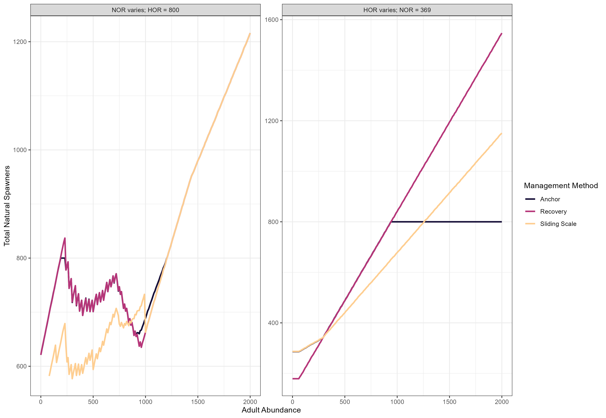
```

```{r val-origin-spawners, fig.cap="Origin-specific spawner abundance predicted under the Anchor, Recovery Phase, and Sliding Scale management frameworks across the evaluated range of natural-origin and hatchery-origin adult abundance."}
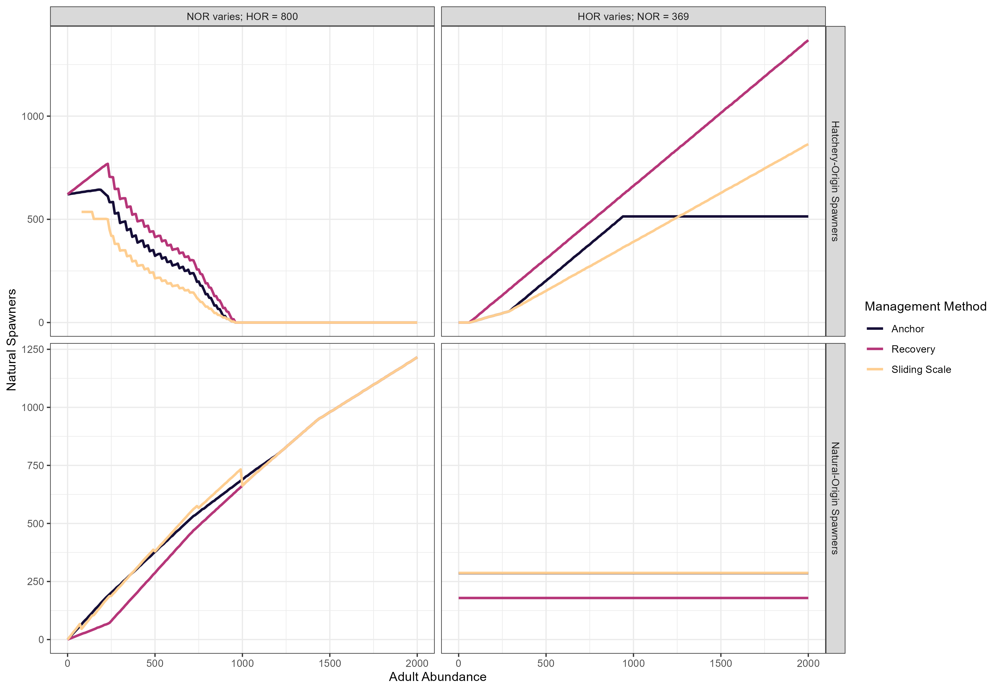
```

### Broodstock Composition

Differences among management frameworks were also evident in the number and origin of adults allocated to broodstock (Figure \@ref(fig:abundance-broodstock)).

```{r abundance-broodstock, fig.cap="Natural-origin and hatchery-origin broodstock predicted under the Anchor, Recovery Phase, and Sliding Scale management frameworks across the evaluated range of adult abundance."}
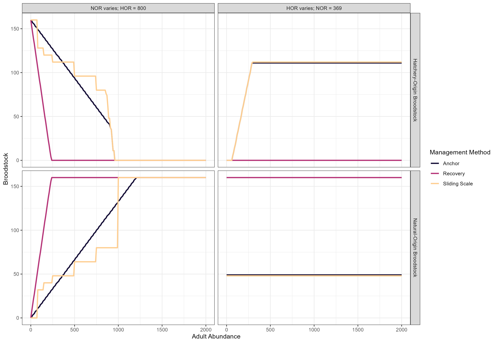
```


### Hatchery Management Metrics

The resulting pNOB, pHOS, and PNI values provide a direct comparison of how each framework changes the relative influence of natural- and hatchery-origin fish across abundance levels (Figure \@ref(fig:abundance-metrics)).

```{r abundance-metrics, fig.cap="Predicted pNOB, pHOS, and PNI under the Anchor, Recovery Phase, and Sliding Scale management frameworks across the evaluated range of adult abundance."}
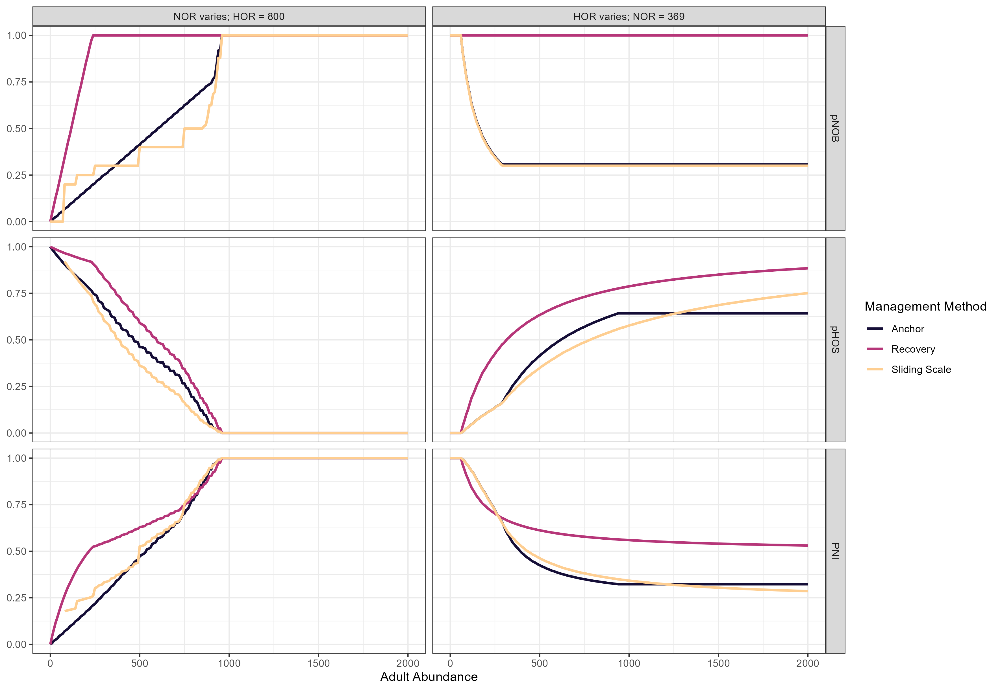
```


### Fishery Effects

Because identical fishery rules were applied to all three management frameworks, predicted fishery mortality was expected to be consistent among frameworks when presented with identical NOR and HOR abundance. Figure \@ref(fig:abundance-harvest) provides an additional validation of this common accounting.

```{r abundance-harvest, fig.cap="Natural-origin fishery impacts and hatchery-origin harvest predicted across the evaluated abundance range. Common fisheries rules were applied to all three management frameworks."}
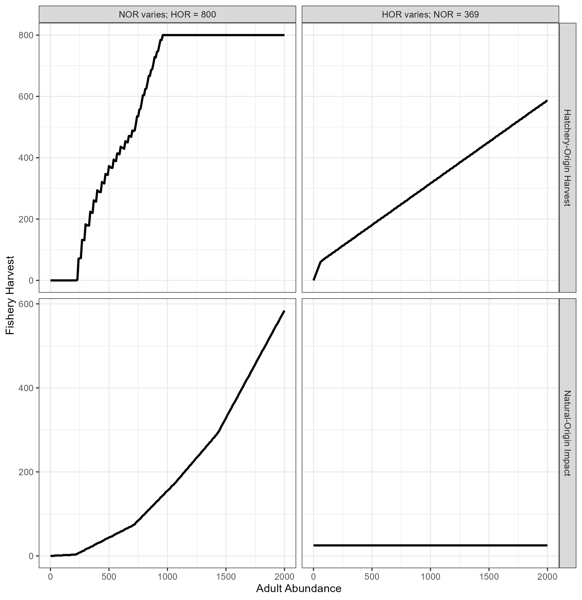
```


# Historical Comparison of Management Frameworks

## Historical Adult Returns

The three management frameworks were applied retrospectively to Lostine River
adult return abundance from 2007 through 2026 (Figure
\@ref(fig:historical-abundance)). This analysis represents a comparison of how the same historical adult returns would have been managed under the Sliding Scale, Anchor Method, and Recovery Phase frameworks.

For each year, observed natural-origin (NOR) and hatchery-origin (HOR) adult
abundance was supplied independently to each management framework. All three
frameworks therefore experienced identical annual adult abundance, fisheries
rules, weir characteristics, and survival assumptions. Differences among
frameworks reflect only differences in broodstock allocation and management of
adults at the weir.

Importantly, demographic and fitness effects associated with a management
framework were not allowed to influence adult abundance in subsequent years.
Each year was reinitialized using the observed Lostine River adult return
abundance. Consequently, this analysis evaluates how alternative management
decisions would have affected the disposition of historical returns but does
not predict how those decisions would have altered future population
abundance.

```{r historical-abundance, fig.cap="Annual abundance estimates of natural- and hatchery-origin adults returning to the Lostine River from 2007 through 2026."}
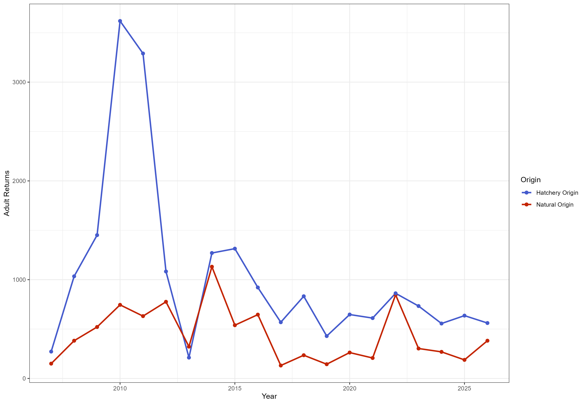
```

## Demographic Outcomes

Application of the three management frameworks resulted in different
allocations of returning adults among hatchery broodstock, natural spawning,
and hatchery-origin removal. Because annual adult returns and fisheries were
held constant among frameworks, differences in these outcomes resulted from
the broodstock and weir management rules associated with each framework.

Total natural spawning abundance resulting from each management framework is
shown in Figure \@ref(fig:historical-spawners), with the natural- and
hatchery-origin components of the spawning population shown separately in
Figure \@ref(fig:origin-spawners). Broodstock composition is presented in
Figure \@ref(fig:broodstock-take), and the disposition of hatchery-origin
adults is presented in Figure \@ref(fig:hatchery-disposition).

```{r historical-spawners, fig.cap="Annual total natural spawning abundance resulting from application of the Sliding Scale, Anchor Method, and Recovery Phase management frameworks to historical Lostine River adult returns."}
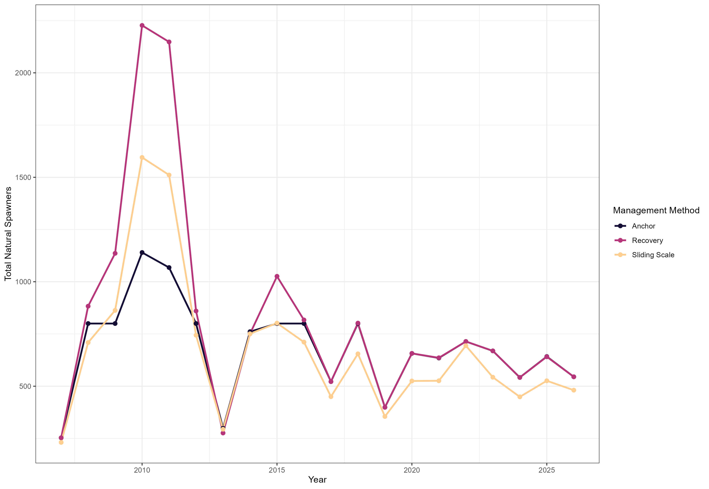
```

```{r origin-spawners, fig.cap="Annual natural- and hatchery-origin spawning abundance resulting from application of the three management frameworks to historical Lostine River adult returns."}
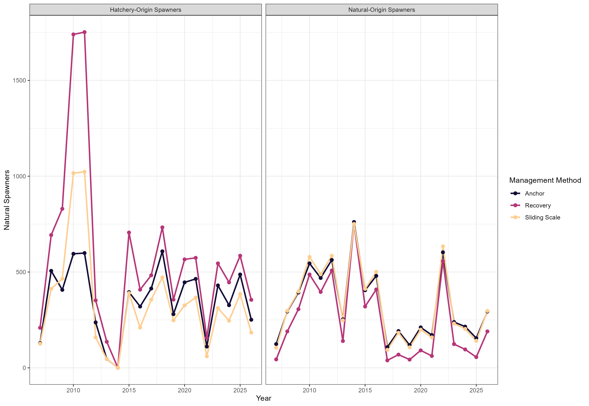
```

```{r broodstock-take, fig.cap="Annual natural- and hatchery-origin broodstock resulting from application of the three management frameworks to historical Lostine River adult returns."}
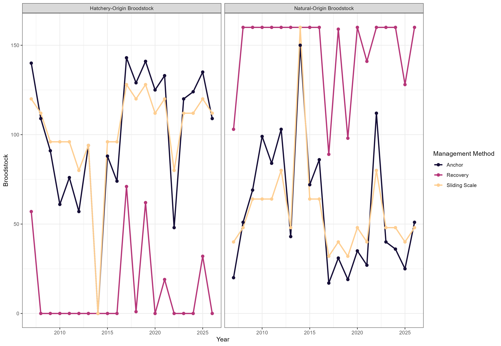
```

```{r hatchery-disposition, fig.cap="Annual disposition of hatchery-origin adults resulting from application of the three management frameworks to historical Lostine River adult returns."}
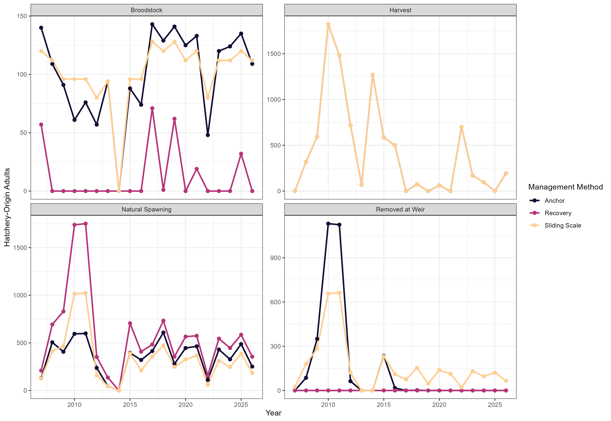
```

## pNOB, pHOS, and PNI

Differences in broodstock collection and hatchery-origin escapement resulted in
different annual trajectories of pNOB, pHOS, and PNI among the management
frameworks (Figure \@ref(fig:management-metrics)). These metrics describe the
relative contribution of natural- and hatchery-origin adults to hatchery
broodstock and natural spawning and provide the primary connection between the
management frameworks and the phenotypic selection model evaluated below.

The Recovery Phase framework generally maintained greater pNOB because
natural-origin broodstock was prioritized across recovery phases. In contrast,
pNOB under the Anchor and Sliding Scale frameworks varied with natural-origin
abundance according to their respective management rules. The frameworks also
differed in their management of hatchery-origin adults available for natural
spawning, resulting in differences in realized pHOS.

The interaction between realized pNOB and pHOS produced the annual PNI values
shown in Figure \@ref(fig:management-metrics). Although PNI summarizes the
relative balance of natural and hatchery influence, similar PNI values can
result from substantially different combinations of pNOB and pHOS. Therefore,
the annual trajectories of pNOB and pHOS, rather than PNI alone, were retained
when evaluating the potential phenotypic and fitness consequences of each
management framework.

```{r management-metrics, fig.cap="Annual pNOB, pHOS, and PNI resulting from application of the Anchor, Recovery Phase, and Sliding Scale management frameworks to historical Lostine River adult returns."}
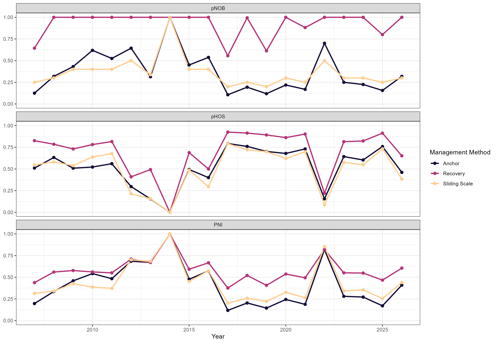
```

# Phenotypic Selection Through Time

## Age-Structured Ford Model

Annual pNOB and pHOS values generated by the management frameworks were used
to evaluate phenotypic selection with the Ford model.

A direct annual implementation of the Ford model would incorrectly treat each
calendar year as a complete Chinook Salmon generation. The historical model
was therefore modified to account for overlapping brood years and age at adult
return.

Adult age composition was assumed to be

\[
q_3 = 0.20,
\]

\[
q_4 = 0.70,
\]

and

\[
q_5 = 0.10.
\]

The phenotype of adults returning in year $t$ was consequently determined by
offspring produced by the contributing brood years. Conceptually,

\[
P_t^{return} =
0.20P_{t-3}^{offspring} +
0.70P_{t-4}^{offspring} +
0.10P_{t-5}^{offspring}.
\]

Natural- and hatchery-origin phenotypes were tracked separately.

This age-structured implementation allows management conditions in a given
brood year to affect the phenotypic composition of adults returning three to
five years later rather than treating adjacent calendar years as successive
generations.


## Natural- and Hatchery-Population Phenotypes

The three management frameworks generated different histories of pNOB and
pHOS and therefore different phenotypic trajectories for the natural and
hatchery populations.

Differences were particularly apparent in the hatchery population. Greater
incorporation of natural-origin adults into hatchery broodstock increased
natural influence on the hatchery population and reduced displacement of the
hatchery phenotype toward the hatchery environmental optimum.

Consequently, pHOS alone does not completely describe the expected influence
of hatchery-origin adults spawning naturally. The expected phenotypic
difference between hatchery- and natural-origin adults depends partly on the
selection history of the hatchery population, which in turn depends strongly
on previous pNOB.

For example, modeled phenotypic values for adults returning in 2026 are shown in Table (\@ref(tab:phenotype-table)). The modeled natural-population phenotypes were relatively similar among the three frameworks in 2026, whereas greater differences remained among
hatchery-population phenotypes. These differences reflect the cumulative
effects of previous broodstock and natural-spawning decisions rather than only
management conditions occurring in 2026. Figure \@ref(fig:phenotypic-response) illustrates the modeled phenotypic changes across the historical time period.

```{r phenotype-table}
ford_historical_age <- readRDS(file = '../../data/output/ford_historical_age.rds')

ford_historical_age %>%
  filter(year == 2026) %>%
  select(
    method,
    P_nat_return,
    P_hat_return
  ) %>%
  knitr::kable(
    digits = 3,
    col.names = c(
      "Management Framework",
      "Natural Phenotype",
      "Hatchery Phenotype"
    ),
    caption = "Modeled natural- and hatchery-population phenotypic values for adults returning in 2026."
  )
```


```{r phenotypic-response, fig.cap="Modeled mean phenotypic values of natural- and hatchery-origin adult returns under the Anchor, Recovery Phase, and Sliding Scale management frameworks. Phenotypic trajectories incorporate the assumed age-3, age-4, and age-5 return distribution."}
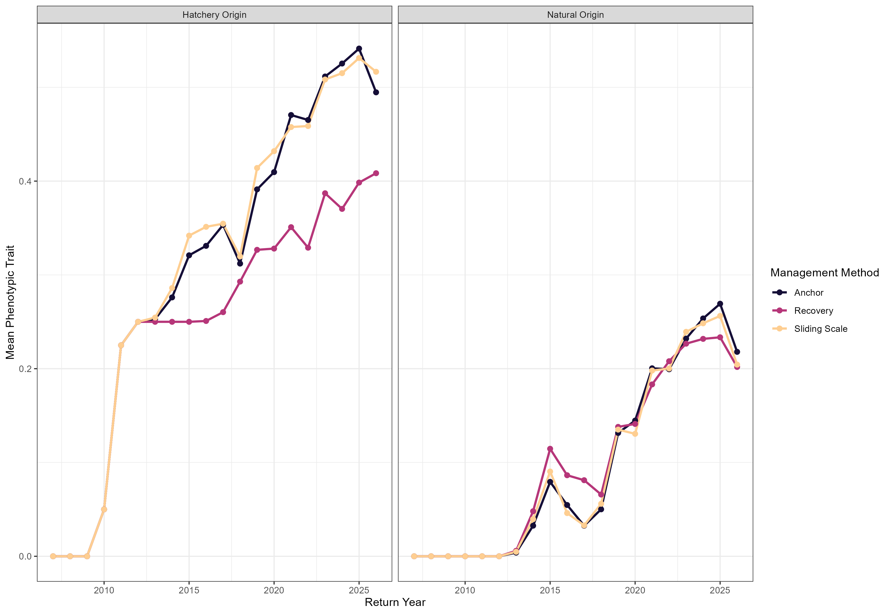
```


# Relative Fitness

Mean phenotypic values were translated to relative fitness in the natural
environment. Fitness was calculated relative to the natural environmental
optimum, such that a population centered on the natural optimum had a relative
fitness of 1.0.

As phenotypic values became displaced from the natural optimum, relative
fitness declined according to the stabilizing-selection relationship specified
by the Ford/AHA parameterization.

Natural-population relative fitness therefore represents the expected fitness
associated with the accumulated phenotypic state of the natural population.
The corresponding hatchery-population fitness describes the expected relative
fitness of the modeled hatchery phenotype when expressed in the natural
environment (Figure \@ref(fig:relative-fitness))

```{r relative-fitness, fig.cap="Modeled relative fitness in the natural environment resulting from phenotypic trajectories under the Anchor, Recovery Phase, and Sliding Scale management frameworks."}
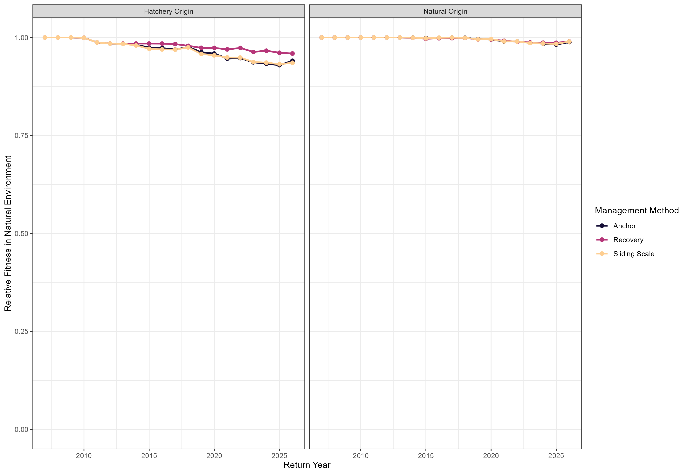
```


## Interpretation of Hatchery Influence

The combined results demonstrate an important distinction between annual
hatchery management metrics and accumulated biological influence.

The annual proportion of hatchery-origin spawners describes the numerical
contribution of hatchery-origin adults to natural spawning, but does not
describe how different those adults are from the natural population. Similarly,
pNOB describes annual broodstock composition but its biological effects can
accumulate across brood years.

Under the Ford model, repeated use of natural-origin adults in hatchery
broodstock can maintain a hatchery population that is more similar to the
natural population. Consequently, two management frameworks producing similar
pHOS can produce different expected selection effects if their previous pNOB
histories have produced hatchery populations with different phenotypic states.

PNI provides a useful annual index of the relative balance between natural and
hatchery influence, but the modeled phenotypic trajectories illustrate that
selection depends on the sequence of management conditions through time rather
than the PNI value from a single year.


# Summary

The Sliding Scale, Anchor, and Recovery Phase frameworks represent different
approaches to balancing hatchery broodstock collection, natural spawning, and
hatchery influence within the Lostine River supplementation program.

Standardizing fisheries, weir accounting, prespawn survival, and other common
assumptions allowed differences among the frameworks to be attributed to their
broodstock and weir management rules.

Sensitivity analyses across NOR and HOR abundance demonstrated how the
frameworks respond to changing adult abundance and provided a means of
identifying accounting errors and biologically unrealistic model behavior.

Application of the three frameworks to historical Lostine River returns
demonstrated that the same adult population could produce substantially
different pNOB and pHOS values depending on the management framework applied.
These annual differences subsequently produced different phenotypic
trajectories when propagated through the age-structured Ford selection model.

The results also illustrate why pHOS should not be interpreted independently
of broodstock history. Hatchery-origin adults produced under management with
greater natural-origin broodstock influence may remain phenotypically more
similar to the natural population than hatchery-origin adults produced under
management with lower natural influence. The potential biological influence
of hatchery-origin natural spawners therefore depends on both their abundance
and the accumulated selection history of the hatchery population.

At this stage, these results describe theoretical changes in phenotypic
selection and relative fitness. They do not yet predict changes in population
productivity or future adult abundance.


# Next Steps: Coupled Selection and Demographic Simulation

The next phase of the analysis will couple the Ford selection model with the
demographic components of the AHA framework.

Rather than supplying observed Lostine River adult abundance independently in
each year, each management framework will begin from a common initial
population state. Management decisions will determine annual pNOB, pHOS,
broodstock composition, and natural spawner abundance. These values will
determine phenotypic selection and relative fitness, and the resulting fitness
effects will modify life-stage productivity and capacity within the AHA
demographic model.

Adult production generated by the demographic model will subsequently return
according to the assumed age structure and become the adult population
available for management in future years.

This simulation will allow the three management frameworks to diverge from a
common initial population and will provide a means of evaluating whether
differences in hatchery management and accumulated selection are sufficiently
large to produce meaningful differences in long-term population productivity
and abundance.